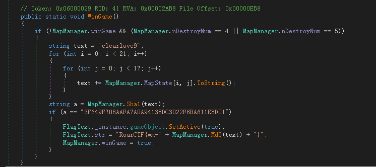
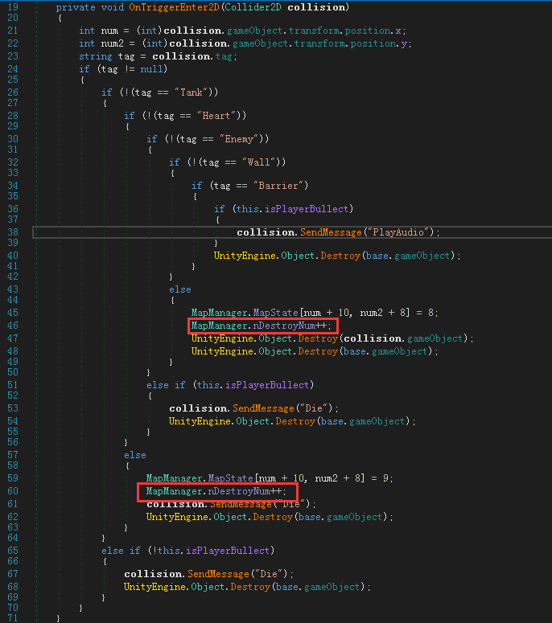
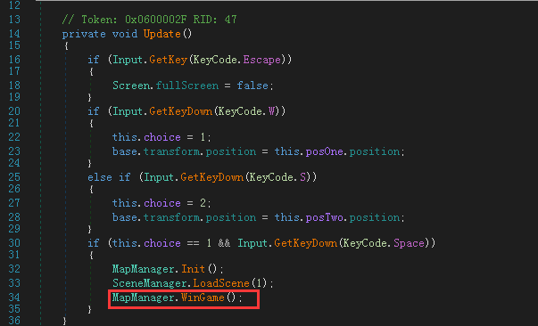
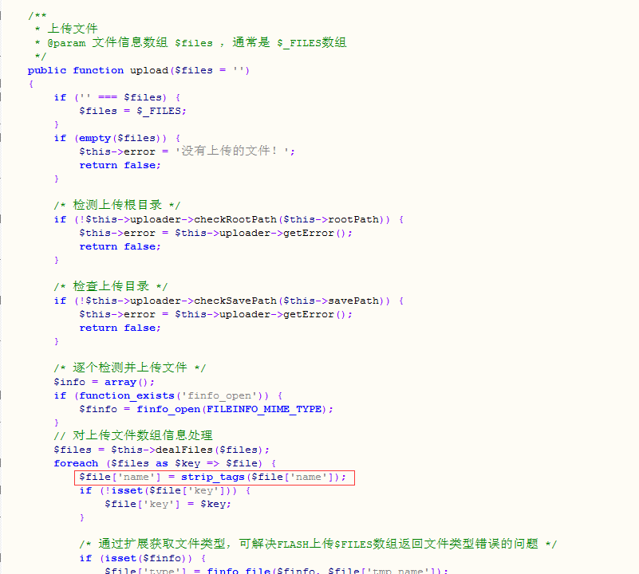
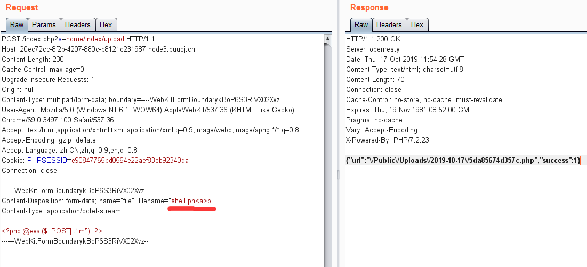

## 比赛信息

> 比赛时间：10月12日-13日
> 比赛网址：https://roarctf.4hou.com/
> 最终排行榜及统计数据：[点击访问](https://github.com/berTrAM888/RoarCTF2019-Scoreboard)
> 官方writeup：https://github.com/berTrAM888/RoarCTF-Writeup-some-Source-Code


## 附件链接

链接：https://pan.baidu.com/s/1flvDC_YXOenodWRcXHz7Ig 提取码：hdxw

链接：https://share.weiyun.com/j1cY37st 密码：u0fepl

外链:https://t1m.lanzous.com/b0aeszr8d 密码:hdxw

部分附件下载：https://github.com/lepPwn/CTF-Games


## Pwn

### easyheap


### GGVM


### baby_pwn


### ez_op
writeup: https://github.com/zh-Processor/Ez_op/blob/master/wp.md


### easyrop


### easypwn


### realloc_magic


### checkin


## Misc

### Sudoku
附件下载：GV18sibUDDNFwK3k3VZnha7jIopKTlMd1.rar


### 签到题
关注微信公众号“嘶吼专业版”，发送题目提示的字符串“7FaNwIbFV4uDN81a”，得到回复的flag
```
RoarCTF{WM-F8oD0cdeUXdHrIUF}
```


### forensic

附件下载：mem.raw


### 调查问卷
> https://wj.qq.com/s2/4758329/f8e8/

```
RoarCTF{Thank_You}
```


### davinci_cipher

附件下载：1xTGs6JrERI4E4DWpBdiD5gYEtUN3S5f.zip


### h.a
附件下载：cC0aL0cJ0dX1aE0lh.zip


### TankGame

附件下载：n6mps8JHqfdHMkG63P6cKDVVfFaYS8oN.zip


假flag：RoarCTF{wm-f1@g_1$_N0t_h3r3}

该游戏由Unity3D编写,游戏代码都在Assembly-CSharp.dll文件中,用dnspy打开，关键代码在MapManager类中的WinGame方法



其中MapManager.nDestroyNum值的改变在Bullect类的OnTriggerEnter2D方法（在变量上右键选择“分析”可以查找）



对比地图数据MapManager.MapState和游戏界面地图可知地图元素对应数字分别为

```
0基地
1砖墙（红色）
2铁墙（白色）
4河（蓝色）
5草（绿色）
8空白（黑色）
9毁坏后基地（上图代码中“Heart”被打后赋值为9）
```

由上述代码可知当打坏4或5个建筑物（砖墙/基地）时，字符串“clearlove9”拼接上地图信息的数字，计算sha1，如果等于“3F649F708AAFA7A0A94138DC3022F6EA611E8D01”，那么取这个拼接后的字符串计算md5取前十位就可以得到flag。地图中的砖（1）总共65个，加上1个基地，所以总共有66个可变的位置，改变其中4个或5个进行爆破（1变8，0变9）。可以把变量提取出来写脚本实现，也可以直接修改游戏代码，这里为了好玩直接在游戏中修改，修改后的WinGame()方法如下
```csharp
using System.IO;

public static void WinGame()
{
    if (!MapManager.winGame)
    {
        // 为了更好玩我把原始地图基地周围的砖改成铁了，所以这里重新定义一下地图信息变量
        int[,] originmap = {
            { 8, 8, 8, 8, 8, 8, 8, 8, 8, 8, 8, 8, 8, 8, 8, 8, 8 }, 
            { 8, 8, 4, 5, 8, 1, 1, 1, 1, 1, 1, 8, 8, 8, 8, 4, 8 }, 
            { 8, 2, 8, 1, 8, 8, 5, 1, 8, 8, 8, 1, 8, 1, 8, 4, 8 }, 
            { 8, 5, 8, 2, 8, 8, 8, 8, 1, 8, 8, 4, 8, 1, 1, 5, 8 }, 
            { 8, 8, 8, 8, 2, 4, 8, 1, 1, 8, 8, 1, 8, 5, 1, 5, 8 }, 
            { 8, 8, 8, 8, 5, 8, 8, 1, 5, 1, 8, 8, 8, 1, 8, 8, 8 }, 
            { 8, 8, 8, 1, 8, 8, 8, 8, 8, 8, 8, 8, 1, 8, 1, 5, 8 }, 
            { 8, 1, 8, 8, 1, 8, 8, 1, 1, 4, 8, 8, 8, 8, 8, 1, 8 }, 
            { 8, 4, 1, 8, 8, 5, 1, 8, 8, 8, 8, 8, 4, 2, 8, 8, 8 }, 
            { 1, 1, 8, 5, 8, 2, 8, 5, 1, 4, 8, 8, 8, 1, 5, 1, 8 }, 
            { 0, 1, 4, 8, 8, 8, 8, 8, 8, 8, 8, 8, 8, 8, 8, 8, 8 }, 
            { 1, 1, 8, 1, 8, 8, 2, 1, 8, 8, 5, 2, 1, 8, 8, 8, 8 }, 
            { 8, 8, 8, 8, 4, 8, 8, 2, 1, 1, 8, 2, 1, 8, 1, 8, 8 }, 
            { 8, 1, 1, 8, 8, 4, 4, 1, 8, 4, 2, 4, 8, 4, 8, 8, 8 }, 
            { 8, 4, 8, 8, 1, 2, 8, 8, 8, 8, 1, 8, 8, 1, 8, 1, 8 }, 
            { 8, 1, 1, 5, 8, 8, 8, 8, 8, 8, 8, 8, 1, 8, 8, 8, 8 }, 
            { 8, 8, 1, 1, 5, 2, 8, 8, 8, 8, 8, 8, 8, 8, 2, 8, 8 }, 
            { 8, 8, 4, 8, 1, 8, 2, 8, 1, 5, 8, 8, 4, 8, 8, 8, 8 }, 
            { 8, 8, 2, 8, 1, 8, 8, 1, 8, 8, 1, 8, 2, 2, 5, 8, 8 }, 
            { 8, 2, 1, 8, 8, 8, 8, 2, 8, 4, 5, 8, 1, 1, 2, 5, 8 }, 
            { 8, 8, 8, 8, 8, 8, 8, 8, 8, 8, 8, 8, 8, 8, 8, 8, 8 }};

         // 基地
        originmap[10, 0] = 9;

        int num = 66;
        // for(int a = 0; a < num - 4; a++){
            // for(int b = 0; b < num - 3; b++){
                for(int c = 0; c < num - 2; c++){
                    for(int d = 0; d < num - 1; d++){
                        for(int e = 0; e < num; e++){

                            string text = "clearlove9";
                            int idx = 0;
                            for (int i = 0; i < 21; i++)
                            {
                                for (int j = 0; j < 17; j++)
                                {
                                    string obj = originmap[i, j].ToString();
                                    if(originmap[i, j] == 1 || originmap[i, j] == 0){
                                        if(idx == c || idx == d || idx == e){
                                            if(originmap[i, j] == 1){
                                                obj = "8";
                                            }else{
                                                obj = "9";
                                            }
                                        }
                                        idx++;
                                    }
                                    text += obj;
                                }
                            }
                            string a = MapManager.Sha1(text);
                            if (a == "3F649F708AAFA7A0A94138DC3022F6EA611E8D01")
                            {
                                FlagText._instance.gameObject.SetActive(true);
                                FlagText.str = "RoarCTF{wm-" + MapManager.Md5(text) + "}";
                                // 直接输出结果到文件
                                StreamWriter streamWriter = new StreamWriter("flag.txt");
                                streamWriter.WriteLine(text);
                                streamWriter.WriteLine(FlagText.str);
                                streamWriter.Close();
                                MapManager.winGame = true;
                                return;
                            }
                        }
                    }
                }
            // }
        // }
    }
}
```

为了方便观察，直接在Option类进入游戏时直接调用修改后的方法



最后得到原文和flag如下
```bash
# 加密前
clearlove9888888888888888888845811111188884882888851888181848858288881884811588888248118818515888885881588881888888188888888181588188188114888881884188518888842888118582851488815189148888888888888811818821885218888888848821182181888118844884248488884881288881881818811588888888188888811528888888828888481828158848888882818818818225888218888284581125888888888888888888

# flag
RoarCTF{wm-805CEC3545}
```


### 黄金6年

题目附件：oG3gA0aA0uA3aO4gB3aB0eT3aF8aN4.zip


视频中书上面有二维码，共四个分别是“C++ Primer Plus”最后一帧、“白帽子将Web安全”最后一帧、“核心原理 逆向工程”最后一帧、“活着”第一帧（这个最好反相处理一下）。四个二维码扫描后的结果为：“key1:i”、“key2:want”、“key3:play”、“key4:ctf”，得到字符串“iwantplayctf”。用010Editor打开视频，在文件最后有一串base64
```
UmFyIRoHAQAzkrXlCgEFBgAFAQGAgADh7ek5VQIDPLAABKEAIEvsUpGAAwAIZmxhZy50eHQwAQADDx43HyOdLMGWfCE9WEsBZprAJQoBSVlWkJNS9TP5du2kyJ275JzsNo29BnSZCgMC3h+UFV9p1QEfJkBPPR6MrYwXmsMCMz67DN/k5u1NYw9ga53a83/B/t2G9FkG/IITuR+9gIvr/LEdd1ZRAwUEAA==
```
解码后发现头部的“Rar”，转为16进制并保存成压缩包，使用“iwantplayctf”解开压缩包得到flag
```
roarctf{CTF-from-RuMen-to-RuYuan}
```
按帧查看视频有两个办法：
1.PotPlayer打开视频，d键（上一帧），f键（下一帧）
2.使用命令：ffmpeg.exe -i 黄金6年.mp4 -q:v 2 -f image2 video_frame\\%07d.jpeg，提取视频每帧的图片到video_frame文件夹（需要先创建）

二维码内容扫描建议使用微信


## Web
### easy_java
打开是一个登录界面，爆破可以得到账号密码：admin admin888，登录后提示“Flag is not here!”。登录界面还有一个help链接，打开后抛出java异常“java.io.FileNotFoundException:{help.docx}”，使用post方法请求该链接可以得到文件。当post请求文件不存在时从返回信息可以知道web容器使用的tomcat和路径、java包名信息。请求“ /Download?filename=/WEB-INF/web.xml ”得到所有服务的路径和java类的信息。访问“ /Flag ”得到信息“Flag is nearby ~ Come on! ! !”。post请求“ /Download?filename=/WEB-INF/classes/com/wm/ctf/FlagController.class ”得到FlagController.class的内容，里面有一个base64字符串“Um9hckNURnt3bS1mNzA1MDJjMS1iZDJiLTQ5ZGYtYWRlYy0zZmYzZWY1OWIwM2F9”，解码后得到flag
```
RoarCTF{wm-f70502c1-bd2b-49df-adec-3ff3ef59b03a}
```


### phpshe


### simple_upload
访问题目链接，得到文件上传源码，由源码得到信息上传使用的是thinkphp，上传会检测php扩展名，限制图片扩展名无效。随便访问404链接，如“/index.php/a”可以得到thinkphp版本号是3.2.4，从官网下载得到源码。查看上传upload()方法源码，文件位置在“ThinkPHP\Library\Think\Upload.class.php”，代码如下图



其中strip_tags会把上传文件名中的html标签删掉（函数具体说明见[php官方文档](https://www.php.net/manual/zh/function.strip-tags.php)），所以上传时把文件名的“.php”用html标签分隔开就好了。上传的路径是“index.php?s=home/index/upload”或者“/index.php/home/index/upload”，上传后用“burpsuite”拦截修改filename如下图，访问返回的文件路径即可得到flag。




### online_proxy


### easy_calc
writeup: https://note.youdao.com/ynoteshare1/index.html?id=d87c86b764ed0c66c09be5b29be0a75e&type=note


### dist


## Reverse
### math


### easy_re


### polyre
https://blog.csdn.net/silencediors/article/details/102546053
```
flag{6ff29390-6c20-4c56-ba70-a95758e3d1f8}
```


### 羊肠小道


### 时间魔法


### zprotect
writeup: https://github.com/zh-Processor/zprotect/blob/master/zprotect.md


## Crypto

### block2


### babyRSA


### RSA


### CoinFlip