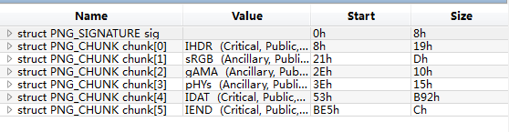

## 比赛信息

> 比赛时间：2019-10-20 08:00 -- 2019-10-27 20:00
> 比赛平台：[X计划平台](https://www.linkedbyx.com/taskinfo/822/detail)
> 竞赛形式：个人赛
> 官方writeup：https://www.ctfwp.com/articals/2019unctf.html


## 附件链接

链接：https://pan.baidu.com/s/17WEoNFgC-CqOWQHZVOnSjA 提取码：hdxw

链接：https://share.weiyun.com/ZeHCNsbo 密码：ume8t6

外链:https://t1m.lanzous.com/b0aeszq9i 密码:hdxw

## WEB
### EasyXSS(500)
> Flag在Cookie里，设置了HttpOnly。
> 题目地址：http://47.94.221.39:8010/


### bypass(800)
> 101.71.29.5:10054

题目源码
```php
<?php
    highlight_file(__FILE__);
    $a = $_GET['a'];
    $b = $_GET['b'];
 // try bypass it
    if (preg_match("/\'|\"|,|;|\\|\`|\*|\n|\t|\xA0|\r|\{|\}|\(|\)|<|\&[^\d]|@|\||tail|bin|less|more|string|nl|pwd|cat|sh|flag|find|ls|grep|echo|w/is", $a))
        $a = "";
        $a ='"' . $a . '"';
    if (preg_match("/\'|\"|;|,|\`|\*|\\|\n|\t|\r|\xA0|\{|\}|\(|\)|<|\&[^\d]|@|\||tail|bin|less|more|string|nl|pwd|cat|sh|flag|find|ls|grep|echo|w/is", $b))
        $b = "";
        $b = '"' . $b . '"';
     $cmd = "file $a $b";
      str_replace(" ","","$cmd"); 
     system($cmd);
?>
```


### NSB Reset Password(300)
> 我们遇到什么glzjin，都不要怕，微笑着面对他，消除glzjin的最好办法就是化身glzjin，坚持，才是胜利，加油，奥力给！！！！！！
> 101.71.29.5:10042


### easy_admin(1000)
> 101.71.29.5:10045,10049


### superwaf(800)
> 101.71.29.5:10023


### 帮赵总征婚(300)
> 华北最大安全集团NSB老总glzjin最近终于找到了girlfriend，但他现在想要six wife了，你能帮他登录一下这个NSB征婚网站吗？


### K&K战队的老家(1000)
> k&k 
> Hint1:admin 万能密码 bypass
> 101.71.29.5:10039


### GoodJava(1000)
> unctf_GoodJava
> hint: 根目录下有/readflag，执行后即可获取flag;
> 101.71.29.5:10038

附件下载：1910245db140ae62379.zip


### 加密的备忘录(1000)
> jmdbwl
> 101.71.29.5:10037


### 简单的备忘录(800)
> Do not forget.
> 101.71.29.5:10012

```
flag{3ad4aaedf408c147d5f747f7ce76d2b4}
```


### Easy_Pentest(1000)

> So easy that it's real worth just 300 Points
> Hint1:tp框架特性，hack fun
> Hint2:万物皆有其根本，3.x版本有，5.x也有，严格来说只能算信息泄露 By Nu1L Veneno
> 101.71.29.5:10021


### checkin(600)
> 101.71.29.5:10010

```
flag{0e4d1980ef6f8a81428f83e8e1c6e22b}
```


### Twice_Insert(500)

> 请加上/index.php，防止血小板入侵。 答案提交flag{}括号内的值。
> 101.71.29.5:10002


### Smile Dog(800)
> hint1：找找内网？ 
> hint2：backup 
> hint3：你够浪吗，要够浪才能做出来
> hint4: ssti
> hint5: 源码泄露的是内网服务的
> 101.71.29.5:10004	

“.index.php.swp”恢复后源码
```go
<?php

type Page struct {
        Name  string
        Input string
}

type Input struct {
        MyName string
        MyRequest *http.Request
}

func sayhelloName(w http.ResponseWriter, r *http.Request) {
        w.Header().Set("X-Powered-By", "PHP/5.4.16")
        var out bytes.Buffer
        var response string
        name := ""

        data, err := ioutil.ReadFile("/flag")
        if err != nil{

        }
        var FLAG = string(data)
        r.ParseForm()
        r.Header.Add("FLAG", FLAG)

        if len(r.Header["Logic"]) > 0{
                name = r.Header["Logic"][0]
        }else {
                name = "No.9527"
        }

Connection interruption...
?>
```


### arbi(1000)

> SimpleHTTPServe真好用 请在后面加上/login，防止血小板入侵。答案提交flag{}括号内的值。 
> Hint1: web根目录下开了一个SimpleHTTPServer服务，但是不能列目录； 
> Hint2: uri路由会检测用户名和请求的url参数是否匹配； 
> Hint3: express框架根目录会有什么一定存在的文件呢?; 
> Hint4: url中有什么字符可以截断呢?; 
> Hint5: bad jwt; 
> Hint6: JWT常见攻击手法; 
> 101.71.29.5:10001

源码下载：VerYs3cretWwWb4ck4p33441122.zip


### 审计一下世界上最好的语言吧(1000)
> 答案提交flag{}括号内的值。
> 101.71.29.5:10003

源码下载：www.zip


## PWN
### babyheap(300)
> 101.71.29.5:10052

附件下载：1910245db1406d3eedd.zip


### babyrop(300)
> 101.71.29.5:10041

附件下载：1910245db1406dc99ea.zip


### EasyShellcode(700)
> 101.71.29.5:10080

附件下载：1910245db140697d9a0.zip


### EasyStack(800)
> 101.71.29.5:10036

附件下载：1910245db14068d148a.zip


### Box(800)
> 101.71.29.5:10035

附件下载：1910245db1406bf1488.rar


### Driver(1000)
> 老司机带带我。 Flag请提交{}内的字串的MD5值。
> 101.71.29.5:10015

附件下载：1910245db140682b8fb.rar


### Soso_easy_pwn(500)
> Just_case.答案提交flag{}括号内的值。如果靶机不能正常访问，请将端口号改为10009
> 101.71.29.5:10000

附件下载：1910245db1406b242b3.rar


### orwHeap(1000)
> 答案提交flag{}括号内的值。
> 101.71.29.5:10005

附件下载：1910245db1406a6d273.zip


## MISC
### 快乐游戏题(100)
附件下载：1910245db1405ca7589.zip

```
UNCTF{c783910550de39816d1de0f103b0ae32}
```


### Hidden secret(600)

原附件下载：1910245db1405132432.zip

（NTFS流失效，题目无解）

> 题目下载链接更新为： 链接：https://pan.baidu.com/s/125zN2324w-lV8ASXfa5zYw 提取码：psp2
> hint:no NTFS,easier

附件下载：附件.zip


### EasyBox(800)
> 101.71.29.5:10011

```
flag{b613e841e0822e2925376d5373cbfbc4}
```


### Happy_puzzle(800)

> Happy_puzzle 签到人的又一力作 
> hint1: png吧 
> hint2：data不是图片，要拼图 
> hint3：idat数据块

附件下载：1910245db140544338d.zip

所给文件是PNG文件的idata数据块，查询资料得到PNG文件的数据结构如下（只保留必须有的数据块）

```
IHDR 数据块: 文件头数据块，描述文件的相关信息，包含图片大小等信息
IDATA 数据块: 图像数据块, 存储图像的具体的像素颜色数据
    1.Length (长度): 大小4字节, 数据块的长度, 取值范围[0,2^31−1]
    2.Chunk Type Code (数据块类型码):大小4字节,数据块的类型由A~Z和a~z等4个ASCII编码的字母组成
    3.Chunk Data (数据块数据): 大小是在Length中设置的大小, 存储对应类型的数据
    4.CRC (循环冗余监测信息): 大小4字节, 全称cyclic redundancy check, 对Chunk Type Code和Chunk Data进行计算得到的, 用来校验数据完整性 ;
IEND 数据块: 图像结束数据块, 是PNG文件的最后一个数据块
```
使用画图新建一个400*400的空白png图片，用010Editor打开并加载PNG模板，得到图片数据结构信息如下图



如上所述只需保留sig、IHDR、IDAT、IEND，复制sig、IHDR的hex为文件头，复制IEND的hex为文件尾，然后把数据文件转为IDAT部分放到中间。其中所给data文件只是IDAT数据块中的Chunk Data数据（可以展开查看IDAT结构），需要补齐另外三部分。至于IDAT的顺序不能确定，只能一个一个的试（这就是题目所说的“拼”图）。具体实现代码如下
```python
import os
import binascii

def ByteToHex(bins):
    return ''.join(["%02X" % x for x in bins]).strip()

base = [str(x) for x in range(10)] + [ chr(x) for x in range(ord('A'),ord('A')+6)]
def dec2hex(string_num):
	num = int(string_num)
	mid = []
	while True:
		if num == 0: break
		num,rem = divmod(num, 16)
		mid.append(base[rem])
	return ''.join([str(x) for x in mid[::-1]]).zfill(8)

def getfile(filename,parent):
    file_path = os.path.join(parent, filename)
    # print('文件名：%s' % filename)
    # print('文件完整路径：%s\n' % file_path)
    f = open(file_path, "rb")
    rd = f.read()
    # 数据块类型码是固定的“IDAT”
    bs = b"\x49\x44\x41\x54"+rd
    hidata = ByteToHex(bs)

    length = dec2hex(len(rd))
    print("length="+length)

    crc32 = dec2hex(binascii.crc32(bs) & 0xffffffff)
    print("crc32 ="+crc32)
    return bytes.fromhex(length+hidata+crc32)

work_dir = "C:\\fakepath\\"
for parent, dirnames, filenames in os.walk(work_dir,  followlinks=True):
    for filename in filenames:
        print(filename)
        if filename.endswith(".data") and filename not in "":#这里添加已经用过的文件名
            f = open(work_dir+filename+".png",'wb')
            f.write(bytes.fromhex("89504E470D0A1A0A0000000D49484452000001900000019008020000000FDDA19B"))
            # f.write(getfile("yvxmeawg.data",parent))
            # f.write(getfile("rnydeiho.data",parent))
            # f.write(getfile("uozjmdnl.data",parent))
            # f.write(getfile("fhnkotmb.data",parent))
            # f.write(getfile("jlxphwfm.data",parent))
            # f.write(getfile("yscijlzx.data",parent))
            # f.write(getfile("ciaoxptf.data",parent))
            # f.write(getfile("blczioav.data",parent))
            # f.write(getfile("jtxsbevz.data",parent))
            # f.write(getfile("lstjobzi.data",parent))
            # f.write(getfile("pyusgabf.data",parent))
            # f.write(getfile("wgkapjbh.data",parent))
            # f.write(getfile("xufbyndk.data",parent))
            # f.write(getfile("csizrgxn.data",parent))
            # f.write(getfile("oaeqnubi.data",parent))
            # f.write(getfile("gpiuezjw.data",parent))
            # f.write(getfile("tihzkoyu.data",parent))
            # f.write(getfile("hbctmwqj.data",parent))
            # f.write(getfile("ycqzmbrw.data",parent))
            # f.write(getfile("fkjhepcs.data",parent))
            # f.write(getfile("kczwtlrd.data",parent))
            # f.write(getfile("dwelszrk.data",parent))
            # f.write(getfile("uilqywot.data",parent))
            # f.write(getfile("xufnmacj.data",parent))
            # f.write(getfile("jrbiznkl.data",parent))
            # f.write(getfile("mrxtfkzj.data",parent))

            f.write(getfile(filename,parent))
            f.write(bytes.fromhex("0000000049454E44AE426082"))
            f.close()
```
如果图片缩略图都显示黑色，可以打开图片查看，完成后图片中显示flag
```
unctf{312bbd92c1b291e1827ba519326b6688}
```

参考链接：https://blog.csdn.net/shulianghan/article/details/97260738


### 信号不好我先挂了(800)
> 信号不好我先挂了。 Flag交不上，多换几种格式。

附件下载：1910245db1404ebe249.zip

```
unctf{9d0649505b702643}
```


### Think
> 下载附件：https://xpro-adl.91ctf.com/userdownload?filename=1910255db2c8ecc2d7f.py&type=attach&feature=custom

备份下载：1910255db2c8ecc2d7f.zip
```
flag{34a94868a8ad9ff82baadb326c513d40}
```


### 亲爱的(300)
> 宁就是HSY？ 答案提交UNCTF{flag}。

附件下载：1910245db1404c0cb71.zip

解压密码是QQ音乐评论“真的上头”

```
UNCTF{W3_L0v3_Unctf}
```


### 无限迷宫(1200)

> 啊哈，来走迷宫试试看啊，很简单的，哈哈哈哈哈哈。答案提交flag{}括号内的值。
> Hint1:图片大小 
> Hint2:上下左右，1234 
> Hint3:密码高达几百位，请勿爆破 
> Hint4:128层，停止手工尝试 
> Hint5:题目没有其他解法，和你心里想的其实是一样的 
> Hint6:重申停止手工尝试，迷宫不是给人走的 
> 附件下载：/unctf2019/1910245db14051a7fd3.zip

```
flag{af810046166d7b8a9c87227fcf341290}
```


### 超速计算器(1200)

> 101.71.29.5:10032

源码下载：code.zip、Chopsic.ttf


## REVERSE
### babyre2（f@ck_re）(300)
> unctf_babyre2的题目下载链接为 链接：https://pan.baidu.com/s/1DXWaTGcuk4WIbZnS45k--w 提取码：h9ds

附加下载：babyre.exe


### 奇怪的数组(600)
附件下载：1910245db14079357c3.zip

```
ad461e203c7975b35e527960cbfeb06c
```


### easyvm(600)

附件下载：1910245db14073996a9.zip


### easy_Maze(700)
附件下载：1910245db140761f917.zip

```
UNCTF{ssddwdwdddssaasasaaassddddwdds}
```


### BabyMips(1000)

> unctf_BabyMips 物联网

附件下载：1910245db1407bdc3dc.zip


### Easy_Android(500)
> 玩手机喽。

附件下载：1910245db1407848f1b.zip

```
bd1d6ba7f1d3f5a13ebb0a75844cccfa
```


### 奇妙的RTF(600)

> Where is Flag？

附件下载：1910245db1407697d75.zip


### 没事，应该不难(800)
> 没事，应该不难

附件下载：1910245db1407d9ae9e.zip


### 666(300)
> 答案提交flag{}括号内的值。

附件下载：1910245db14072dc12f.zip

```
unctf{b66_6b6_66b}
```


### BabyXor(600)

> 答案提交flag{}括号内的值。

附件下载：1910245db1407470ae6.zip


## CRYPTO
### ECC和AES基础(500)
> unctf_ECC和AES基础 请到http://132.232.125.125 POST flag=你的flag

附件下载：1910245db140410cd13.zip

```
this_is_a_flag
```


### simple_rsa(1000)

附件下载：1910245db14042597e6.zip


### 不仅仅是RSA(500)
> It's not only RSA. 答案提交flag{}括号内的值。

附件下载：1910245db14014309ed.zip

这个附件微云显示违规，申诉失败，所以微云没存


### 一句话加密(500)

> Easy_Crypto 答案提交flag{}括号内的值。

附件下载：1910245db140417db1a.zip