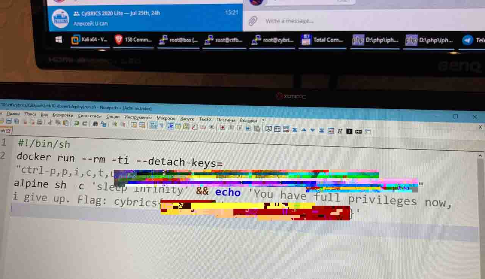

## CYBRICS CTF

### 题目类型

> There will be 28 challenges assorted into seven categories:
>
> - **Web** — web technologies and vulnerabilities,
> - **Forensics** — analyzing data formats, logs and digital evidence,
> - **Reversing** — understanding the algorithm of an executable,
> - **Network** — messing with packets and examining packet dumps,
> - **CTB** — Crack-The-Box, getting code execution on a remote box,
> - **Cyber** and **rebyC** — miscellaneous challenges, everything else: cryptography, fun quirks, coding, etc.
>
> Each category will have four difficulty levels: **Baby**, **Easy**, **Medium** and **Hard**.
>
> Dynamic scoring will be used: the more teams solve a challenge, the less it will cost in the end.

### 比赛信息

> 比赛网址：https://cybrics.net/
>
> 比赛时间：2020-07-25 18:00~2020-07-26 18:00


### Writeup

[2020-CyBRICS_writeup.pdf](../writeup/2020-CyBRICS_writeup.pdf)


## 附件链接

链接：https://pan.baidu.com/s/1f9JuESAS3rys-PdlSNJIeA 提取码：hdxw

链接：https://share.weiyun.com/Yo8Ljyqs 密码：2jho0g

外链:https://t1m.lanzous.com/b0af1w5ba 密码:hdxw


## Cyber

### Mic Check (Baby, 50 pts)

> Author: Vlad Roskov ([@mrvos](https://t.me/mrvos))
>
> Have you read the [game rules](https://cybrics.net/rules)? There's a flag there. But this year it's ENCRYPTED, the same way as UserAssist values in Windows.
>
> **Also be sure to join [@cybrics Telegram chat](https://t.me/cybrics)** for challenge-related announcements and contacting orgs in case all goes wrong


### Broken Invitation (Baby, 50 pts)

> Author: Vadim Davydov ([@vadimdavydov](https://t.me/vadimdavydov))
>
> Help Nick recall how he invited his friends to the birthday party. Download details: [**broken_invitation.pdf**](https://cybrics.net/files/broken_invitation.pdf)

附件下载：broken_invitation.pdf


### Serial (Easy, 63 pts)

> Author: Artur Khanov ([@awengar](https://t.me/awengar))
>
> We have OSINTed a part of algorithm for serial code verification. Help us hack it! Our mathematicians say it's impossible!
>
> [**109.233.57.94:46090/**](http://109.233.57.94:46090/)
>
> Source code: [**serial.tar.gz**](https://cybrics.net/files/serial.tar.gz)

附件下载：serial.tar.gz


### Encrypted FS (Medium, 279 pts)

> Author: Alexander Menshchikov ([@n0str](https://t.me/n0str))
>
> Brand new Python file storage. Gist 2.0: [**efs-cybrics2020.ctf.su/**](http://efs-cybrics2020.ctf.su/)
>
> Still in beta due to several bugs. **Source code: [efs.tar.gz](https://cybrics.net/files/efs.tar.gz)** **Fixed source code: [efs_fixed.tar.gz](https://cybrics.net/files/efs_fixed.tar.gz)** **Repaired source code: [efs_repaired.tar.gz](https://cybrics.net/files/efs_repaired.tar.gz)**
>
> You will get flag if you download Admin's secret message with fileid=`adminEd6TeQ9rI82`
>
> **11:30 —** the challenge was updated to fix unintended solution, thanks to team **PooksandKaks**
>
> **12:30 —** the challenge was updated to repair it from another unintended solution, thanks to team **perfect blue**

附件下载：efs_repaired.tar.gz


### Too Secure (Medium, 237 pts)

> Author: Vadim Davydov ([@vadimdavydov](https://t.me/vadimdavydov))
>
> Find a vulnerability in our novel message commitment system. Read the paper here: [**too_secure.pdf**](https://cybrics.net/files/too_secure.pdf)
>
> Enter decimal `**r2**` value as the flag. Flag format here is **NOT** `cybrics{...}`
>
> **13:43 —** to clarify, *x* in the scheme is the message we're committing to
>
> **18:50 —** there was a discrepancy between the checker and specification, please resubmit your number if you think you've been affected. Though that shouldn't be the case, according to the logs
>
> ```
> Artem Vasilyev, [25.07.20 19:58]@mrvos @vadimdavydov "Too Secure", section "Commitment", is c = G * h^r calculated modulo P?Vadim Davydov, [25.07.20 20:24]Yes
> ```

附件下载：too_secure.pdf


### Botmaster (Hard, 500 pts)

> Author: Artur Khanov ([@awengar](https://t.me/awengar))
>
> Our employee was hacked. We took a memory dump and switched off his computer.
>
> Please investigate, maybe someone has exfiltrated any secrets from his machine.
>
> **Memory dump: [botmaster.tar.gz](https://cybrics.net/files/botmaster.tar.gz)**

附件下载：botmaster.tar.gz（186M）


## CTB

### DockEsc (Baby, 75 pts)

> Author: Vlad Roskov ([@mrvos](https://t.me/mrvos))
>
> Hey, check it out: i've just shoulder-surfed CyBRICS organizers and got the command they run to deploy new service on every connection!
>
> 
>
> Looks like they are planning to give you the flag if you **Escape the Docker!**
>
> Alas, my camera broke the JPEG at the very sweet spot. I wonder if we can somehow get that `--detach-keys` value
>
> ```
> ssh dockesc@109.233.57.94
> Password: B9Go9eGS
> ```


### OTP (Easy, 292 pts)

> Author: Alexander Menshchikov ([@n0str](https://t.me/n0str))
>
> Another mad startuppers create another brand new authentication system...
>
> Check their website: [**otp-cybrics2020.ctf.su/**](http://otp-cybrics2020.ctf.su/)

源码下载：OTP.zip


### Whale Corp (Medium, 469 pts)

> Author: Vlad Roskov ([@mrvos](https://t.me/mrvos))
>
> Whale Corp™, a Linux system library vendor, got them a new CI system. And they keep a flag in `/root/flag` there. Show them that it is a bad idea.
>
> ```
> ssh whalecorp@109.233.57.94
> Password: tZo1vebP
> ```


### Pwnogram (Hard, 424 pts)

> Author: Egor Zaytsev ([@groke](https://t.me/groke))
>
> We made our own messenger! Can you prove that it is not very secure?
>
> Download: [**pwnogram.tar.gz**](https://cybrics.net/files/pwnogram.tar.gz)
>
> ```
> nc 34.77.235.192 2222
> ```
>
> Your Team token: xxxxxxxxxxxxxxxxxxx
>
> *Submit the flag from the server here*

附件下载：pwnogram.tar.gz


### Pwnogram Part II (Hard, 500 pts)

> Author: Egor Zaytsev ([@groke](https://t.me/groke))
>
> Next, can you conduct an attack on the messenger client?
>
> Download: [**pwnogram.tar.gz**](https://cybrics.net/files/pwnogram.tar.gz)
>
> ```
> nc 34.77.235.192 3333
> ```
>
> *Submit the flag from the client here*

附件下载：pwnogram.tar.gz（和上一题相同）


## Forensic

### Keyshooter (Baby, 50 pts)

> Author: Artur Khanov ([@awengar](https://t.me/awengar))
>
> His friend was filming while he was entering the password for the flag. OMG he's shooting letters from his fingers!
>
> Decrypt the flag.
>
> [**keyshooter.tar.gz**](https://cybrics.net/files/keyshooter.tar.gz)

附件下载：keyshooter.tar.gz


### Krevedka (Easy, 50 pts)

> Author: Artur Khanov ([@awengar](https://t.me/awengar))
>
> Some user of our service hacked another user.
>
> Name of the victim user was 'caleches'. But we don't know the real login of the attacker. Help us find it!
>
> [**krevedka.tar.gz**](https://cybrics.net/files/krevedka.tar.gz)
>
> Flag format: cybrics{*login of the attacker*}

附件下载：krevedka.tar.gz


### CodeShot (Medium, 352 pts)

> Author: Alexander Menshchikov ([@n0str](https://t.me/n0str))
>
> Our startup department recently came up with a new code embedding service. You can share your code in image format. Check it out now, maybe you can provide us some free pentest 😼: [**codeshot-cybrics2020.ctf.su/**](http://codeshot-cybrics2020.ctf.su/)
>
> Admin user has the flag in his private images.


### Incident (Hard, 500 pts)

> Author: Egor Zaytsev ([@groke](https://t.me/groke))
>
> Our users recently have complained that their passwords stored in our service were constantly leaking 😱
>
> We identified an infected node, and it looks like it was an APT that installed a software implant right inside our service.
>
> Can you investigate what has happened and find out what data the attackers have stolen?
>
> ```
> ssh incident@35.228.133.151
> Password: 6fS0jH9T
> ```
>
> We understand that you can't dump memory or attach with the debugger since it's Docker, but we're sure you'll figure it out!
>
> **Hint at 20:00 —** We know that out service is vulnerable, and the backdoor was installed via exploitation of this vuln. If you want to dump the backdoor, you should exploit this vuln too


## Network

### XCorp (Baby, 50 pts)

> Author: Artur Khanov ([@awengar](https://t.me/awengar))
>
> We got into the XCorp network and captured some traffic from an employee's machine. Looks like they were using some in-house software that keeps their secrets.
>
> [**xcorp.tar.gz**](https://cybrics.net/files/xcorp.tar.gz)

附件下载：xcorp.tar.gz


### Google Cloud (Easy, 96 pts)

> Author: Vlad Roskov ([@mrvos](https://t.me/mrvos))
>
> I am storing some important stuff in Google's cloud.
>
> Nooo no no, not on Google's disks — in the cloud itself.
>
> [**gcloud.tar.gz**](https://cybrics.net/files/gcloud.tar.gz)

附件下载：gcloud.tar.gz


### Moneylovers (Medium, 376 pts)

> Author: Artur Khanov ([@awengar](https://t.me/awengar))
>
> We captured a transmission between a client and his bank. Help us hack it
>
> [**moneylovers.tar.gz**](https://cybrics.net/files/moneylovers.tar.gz)

附件下载：moneylovers.tar.gz


### NET fleeks (Hard, 469 pts)

> Author: Vlad Roskov ([@mrvos](https://t.me/mrvos))
>
> This NET fleeks video streaming service is booming. Their stock is skyrocketing during #stayhome times.
>
> And they also have a laughably weak password on one of their boxes in production network! The box seems to be empty though, take a look if you can somehow make use of it.
>
> ```
> ssh netfleeks@109.233.57.94
> Password: qwerty
> ```
>
> Your team token > xxxxxxxxxxxxxxxxxxxx
>
> **Hint at 20:00 —** If the workstation is diskless, then how does it boot and where does it keep the data? Can we somehow leverage that we're in the same network? Can we peek and/or tamper with it? We need to get root shell on that box at the end of the day...


## rebyC

### Hellish Reverse (Baby, 50 pts)

> Author: Vlad Roskov ([@mrvos](https://t.me/mrvos))
>
> Finally, decent random guessing challenges on CyBRICS!
>
> **Get the flag: [hellishreverse.tar.gz](https://cybrics.net/files/hellishreverse.tar.gz)**

附件下载：hellishreverse.tar.gz


### Quiz (Easy, 195 pts)

> Author: Alexander Menshchikov ([@n0str](https://t.me/n0str))
>
> Everyone loves quizzes. Even aliens 👽.
> Try to solve a typical alien quiz: [@AlienQuizBot](https://t.me/AlienQuizBot)
>
> *If the bot seems to be down, try to send `/start` command. Telegram can forget about webhooks sometimes. This won’t break your session. If the bot is still down after that, message the orgs :)*


### CatGirl Breach (Medium, 273 pts)

> Author: Stanislav Rakovskiy ([@hexadec1mal](https://t.me/hexadec1mal))
>
> CatGirl Industrials was breached by a malware attack from their competitors. They have lost all their secret flags to the encrypting ransomware! Can you decrypt their most precious flag?
>
> Download: [**catgirlbreach.tar.gz**](https://cybrics.net/files/catgirlbreach.tar.gz)

附件下载：catgirlbreach.tar.gz


### Crcrcr (Hard, 406 pts)

> Author: Egor Zaytsev ([@groke](https://t.me/groke))
>
> I created a simple service that encrypts flag (and your data) with RC4! I bet you can't the extract flag from there :)
>
> [**crcrcr-cybrics2020.ctf.su/**](http://crcrcr-cybrics2020.ctf.su/)
>
> Source code: [**crcrcr.tar.gz**](https://cybrics.net/files/crcrcr.tar.gz)
>
> **Hint at 20:00 —** When I wanna know how Python objects are stored in memory, I can do:
>
> ```
> terminal1:
> python3
> >>> s = b"qweqweqweqwe";
> terminal2: gcore `pidof python3`
> ```
>
> And then look at resulting core file, get xref to `qweqweqeqwe`, and try to find out how Python objects are stored in memory.
>
> And I guess I will be happy to find `cipher.S` (rc4 state) in the coredump

源码下载：crcrcr.tar.gz


## Reverse

### Baby Rev (Baby, 50 pts)

> Author: Egor Zaytsev ([@groke](https://t.me/groke))
>
> I started teaching my daugther some reversing. She is capable to solve this crackme. Are you?
>
> Download: [**babyrev.tar.gz**](https://cybrics.net/files/babyrev.tar.gz)
>
> This link can be helpful: [**snap.berkeley.edu/offline**](https://snap.berkeley.edu/offline)

附件下载：babyrev.tar.gz


### Polyglot (Easy, 50 pts)

> Author: Egor Zaytsev ([@groke](https://t.me/groke))
>
> Prove us that you are a real polyglot :)
>
> Download: [**polyglot.tar.gz**](https://cybrics.net/files/polyglot.tar.gz)

附件下载：polyglot.tar.gz


### Hide and Seek (Medium, 241 pts)

> Author: Egor Zaytsev ([@groke](https://t.me/groke))
>
> Help me find the valid key!
>
> Download: [**hideandseek.tar.gz**](https://cybrics.net/files/hideandseek.tar.gz)

附件下载：hideandseek.tar.gz


### Hacked Again (Hard, 500 pts)

> Author: Vlad Roskov ([@mrvos](https://t.me/mrvos))
>
> We recently noticed that there is some abnormal activity on our lab server, which is not being reflected in authentication logs. We suspect it might result from some unauthorized access.
>
> The forensic professionals we hired had some progress, and even got in touch with Interpol, but then somehow they stopped responding. We still don't know what it was, and who might be the perpetrator.
>
> Can you glance at the server too? We need the crook's real name.
>
> ```
> ssh hackedagain@109.233.57.94
> Password: FXujp85X
> ```
>
> Oh, Interpol also got us this: [**c2_log_2020-07-24.log**](https://cybrics.net/files/c2_log_2020-07-24.log). No idea what that is though.
>
> ```
> Artyom Kadushko, [25.07.20 18:22]
> Is this ip is a part of chall? http://35.242.197.71/
> (Taken from c2_log_2020-07-24.log)
> 
> Vlad Roskov, [25.07.20 18:22]
> yes
> ```
>
> **Hint at 20:00 —** You definitely need to lay your hands on the malware author's private docs... perhaps that contains his true identity. Looks like there are two bots in the botnet left: you, and the initial one that the backdoor was tested on!
>
> ```
> Vladas, [25.07.20 20:53]
> should c2 be down in "hacked again"?
> 
> Vlad Roskov, [25.07.20 20:54]
> yes
> ```


## Web

### Hunt (Baby, 50 pts)

> Author: Vlad Roskov ([@mrvos](https://t.me/mrvos))
>
> I couldn't not make this web10
>
> [**http://109.233.57.94:54040/**](http://109.233.57.94:54040/)
>
> *Shamelessly taken from © Matthew Rayfield*


### Gif2png (Easy, 52 pts)

> Author: Alexander Menshchikov ([@n0str](https://t.me/n0str))
>
> The webdev department created another cool startup. Here you can convert any animated GIF to PNG images. It's only left to figure out how to monetize it: [**gif2png-cybrics2020.ctf.su/**](http://gif2png-cybrics2020.ctf.su/)
>
> Sources [are available](https://cybrics.net/files/gif2png.tar.gz)

源码下载：gif2png.tar.gz


### WoC (Medium, 209 pts)

> Author: Vlad Roskov ([@mrvos](https://t.me/mrvos))
>
> http://109.233.57.94:40389/calcs/85d45135a1c6f4c3/cc4b5923-6498-44ff-391a-03a16f35d485.php
>
> Heheh heh hehh... 🤓
>
> **Source code: [woc.tar.gz](https://cybrics.net/files/woc.tar.gz)**

源码下载：woc.tar.gz


### Developer's Laptop (Hard, 376 pts)

> Author: Alexander Menshchikov ([@n0str](https://t.me/n0str))
>
> We have prepared a new startup. Free design feedback.
> Lets make our websites look better: [**free-design-feedback-cybrics2020.ctf.su/**](http://free-design-feedback-cybrics2020.ctf.su/)
> Team token: `xxxxxxxxxxxxxxxxxxxxxx`
>
> Their developer's laptop is your target