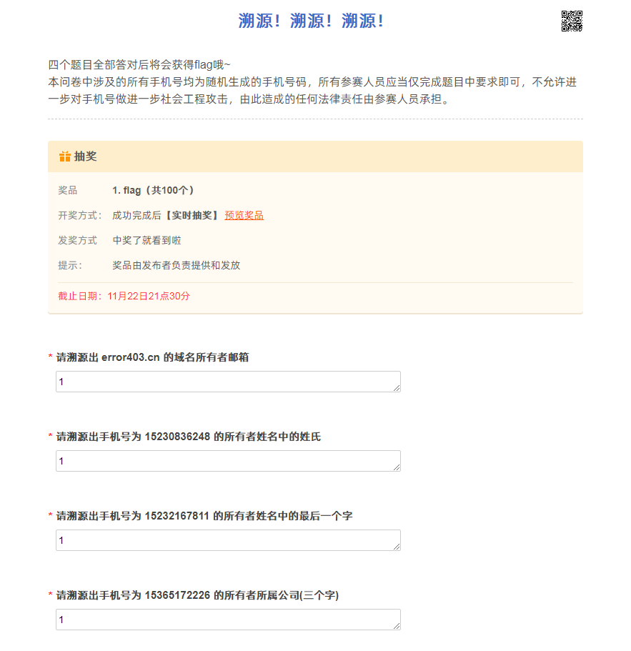

## 比赛信息

> 比赛名称：HECTF河北师范大学信息安全挑战赛
>
> 比赛网址：https://hectf.ctftraining.cn/
>
> 比赛时间：2020年11月21日 09:30-2020年11月22日 21:30

<br/>

### writeup

[HECTF WP-齐鲁师院网络安全社团](https://mp.weixin.qq.com/s/SWjgzRRm8-RKCRRSrLYbRw)

<br/>

### 附件链接

链接：https://pan.baidu.com/s/1K8hc4ukjpomHjy90RqqzSA 提取码：5555

链接：https://share.weiyun.com/T8xyMdrg 密码：555555

外链：https://t1m.lanzous.com/b0afbxfgb 密码：5555

<br/>

## 题目信息

### MISC

#### 【真签到题】快来看直播啦~(459s,50p)

> 本题赏金：1元
>
> 前往直播间，~~调戏小蓝蓝~~获取flag。
>
> 注：本题衰减极限将为500
>
> https://live.bilibili.com/6789627

```
HECTF{狮虎萌轻一点打出题人好吗嘤嘤嘤}
```

<br/>

#### 【校内专属】请你找到我(17s,489p)

> 本题赏金：0元
>
> 注意：本题flag位于河北师范大学计算机与网络空间安全学院D-114机房，线上答题的各位同学请直接跳过本题。
>
> 快来找找我在哪吧~
>
> 解题需要前往线下比赛场地哦，场地内有饮水、网络、零食、暖气，大家快来玩鸭~
>
> 线下机房将于本周六晚22:00关闭，请想做这道题的选手尽快前往场地，逾期将无法解出。
>
> 本题作为校内赛道专属题，最高分降为500分，衰减极限将为100人，最低分保持不变。

<br/>

#### png(220s,50p)

> 本题赏金：3元
>
> 好可爱的小猫咪鸭~
>
> 备用链接：https://share.weiyun.com/kMivzGyU 密码：mnnwiw

附件下载：flag.zip

<br/>

#### 【The End】世界的终焉(161s,50p)

> 本题赏金：0元(问卷内有抽奖)
>
> **本题不做一血通报，请各位选手好好填写，不要着急**
>
> 终于，你来到了本次HECTF的尽头
>
> 突然一个背着大板子的地精跳了出来！骚年！留个言吗！
>
> http://traceability.ctftraining.cn/jq/98289565.aspx

```
flag{dce262d5-3b1f-47cc-8298-9dea1b95ad9e}
```

<br/>

#### 不说人话(156s,50p)

> 本题赏金：2元
>
> 阴阳怪气？！
>
> 备用链接：https://share.weiyun.com/uLb9oPAk 密码：u2mbcw

附件下载：short.zip

<br/>

#### 溯源！溯源！溯源！(47s,911p)

> 本题赏金：4元
>
> 让我们一起来愉快的溯源吧~
>
> 本答卷中涉及的所有手机号均为随机生成的手机号码，所有参赛人员应当仅完成题目中要求即可，不允许进一步对手机号做进一步社会工程攻击，由此造成的任何法律责任由参赛人员承担。
>
> 问卷密码即为参赛者的初始参赛密码。
>
> 每位参赛者有5次挑战机会，每次挑战需要在10分钟内挑战完毕。 每次挑战结束，成功的挑战者将获得flag，失败的挑战者会获得一次抽奖机会，有1%的概率直接抽中flag。
>
> 挑战链接：http://traceability.ctftraining.cn/jq/98028270.aspx
>
> hint1: 企业微信

问题示例如下



<br/>

#### FakeTrojan(0s,1000p)

> 本题赏金：8元
>
> 这是一个"木马"文件
>
> 你能发现是谁制作了这个"木马"吗?
>
> 将其找出他 flag就藏在他的相册中
>
> 相册图片一定要查看原图后再下载 否则可能造成图像数据错误的情况
>
> flag格式:"HECTF{}"
>
> 备用链接：https://share.weiyun.com/4rrx2sb9 密码：9s5nak
>
> hint1: 这个蛇为啥被放在了箱子里呢，要不拆开看看？

附件下载：FakeTrojan.rar

<br/>

#### babyMisc(2s,1000p)

> 本题赏金：8元
>
> 这是一个非常简单的misc
>
> 你能发现其中的秘密吗?
>
> 文件hex尾部有编码后的flag的后两位
>
> flag格式:"HECTF{}"
>
> 备用链接：https://share.weiyun.com/gL0ZiSOH 密码：enb695
>
> hint1: PE也想有session？这么小声也想有session？

附件下载：BabyMisc.rar

<br/>

#### Make Steg Great Again(5s,999p)

> 本题赏金：7元
>
> Can You Make Steg Great Again?
>
> 备注：
>
> 此题计划投往安恒，但实际最终未投递，故flag格式为DASCTF{.+}，并非题目侵权，特此声明
>
> 备用链接：https://share.weiyun.com/2YUTNA0o 密码：atbg6m
>
> hint1: 那一天大雪纷飞~That day heavy snow
>
> hint2: 嘤！有只蛇叼走了我的钥匙，还藏了起来呜呜呜~——小蓝蓝
>
> hint3: 解题思路和py文件源码无关

附件下载：Make_Steg_Great_Again.rar

<br/>

#### 【BOOM】憨憨出题人(8s,998p)

> 本题赏金：6元
>
> 主办方平时通过QQ2151948739与这位出题人联系，但在比赛前夕出题人却不见了，请参赛者们自己找一下
>
> 题目并完成哟∠(:」∠)_
>
> flag格式HECTF{.+}
>
> hint1: 期中考试成绩下发了，小明往旁边撇了一眼，依稀看见“林好好 高等数学100”的字样
>
> hint2: 林好好发现自己和很多人一样总用弱密码，但是她很懒并没有改
>
> hint3: 百度一下，你就知道

<br/>

### REVERSE

#### Hello_Re(136s,231p)

> 本题赏金：2元
>
> 萌新说题太难了，来尝试一下这个简单的叭！附件压缩包解压密码统一为HECTF2020
>
> 备用链接：https://share.weiyun.com/bnUHTLLV 密码：mc34z3

附件下载：Hello_Re.zip

<br/>

#### game1(93s,643p)

> 本题赏金：3元
>
> 凭借各位单身多年的手速，达到目的分数成功拿到flag应该不难吧？ 附件压缩包解压密码统一为HECTF2020
>
> 备用链接：https://share.weiyun.com/etNJuPuH 密码：6dv79q

附件下载：game1.zip

<br/>

#### easymaze(50s,899p)

> 本题赏金：3元
>
> 附件压缩包解压密码统一为HECTF2020
>
> 备用链接：https://share.weiyun.com/YjtoDdqH 密码：jpsue6 tips：请提交最短路径

附件下载：maze.zip

<br/>

#### emmmm(34s,955p)

> 本题赏金：4元
>
> 好像和之前的有些不一样……
>
> 附件压缩包解压密码统一为HECTF2020
>
> 备用链接：https://share.weiyun.com/5hyuPZe0 密码：9i6f9a

附件下载：emmmm.zip

<br/>

#### game2(11s,996p)

> 本题赏金：5元
>
> 打什么比赛啊，来玩！
>
> 附件压缩包解压密码统一为HECTF2020
>
> 备用链接：https://share.weiyun.com/oUwD6rwV 密码：hsa8wi

附件下载：game2.zip

<br/>

#### rev(1s,1000p)

> 本题赏金：7元
>
> Let's go！
>
> 附件压缩包解压密码统一为HECTF2020
>
> 附件下载链接：https://share.weiyun.com/CjiJz7wI 密码：yd7mmz
>
> hint1: https://github.com/sibears/IDAGolangHelper

附件下载：rev.zip

<br/>

#### decryption(10s,997p)

> 本题赏金：7元
>
> 干就完了！
>
> 附件压缩包解压密码统一为HECTF2020
>
> 备用链接：https://share.weiyun.com/LA13Pimk 密码：u35csm

附件下载：decryption.zip

<br/>

### WEB

#### 【BOOM】ezphp(213s,50p)

> 本题赏金：3元
>
> 蛾子！你怎么跑到了。。。。php上？
>
> http://121.196.32.184:8081/

```php
 <?php 
error_reporting(0);
highlight_file(__file__);
include('flag.php'); 
$string_1 = $_GET['str1']; 
$string_2 = $_GET['str2']; 

if($_GET['param1']!==$_GET['param2']&&md5($_GET['param1'])===md5($_GET['param2'])){

        if(is_numeric($string_1)){ 
            $md5_1 = md5($string_1); 
            $md5_2 = md5($string_2); 
            if($md5_1 != $md5_2){ 
                $a = strtr($md5_1, 'cxhp', '0123'); 
                $b = strtr($md5_2, 'cxhp', '0123'); 
                if($a == $b){
                    echo $flag;
                }
                else {
                    die('you are close');
                }
            }  
            else {
               die("md5 is wrong"); 
            }
            } 
        else {
        die('str1 not number'); 
        }
    }
else {
    die('you are wrong!');
}
?>
```

<br/>

#### 签到(198s,50p)

> 本题赏金：3元
>
> 登录就送flag~
>
> http://121.196.32.184:8080/
>
> hint1: hint.php

源码下载：签到.zip

<br/>

#### ssrfme(107s,526p)

> 本题赏金：5元
>
> 绕过人海，走进服务器内心的世界。
>
> http://114.55.165.246:12003/

```php
<?php
error_reporting(0);
highlight_file(__FILE__);
//try flag.php
function filter($url) { 
    $match_result=preg_match('/^(http|https)?:\/\/.*(\/)?.*$/',$url); 
    if (!$match_result) 
    { 
        die('url fomat error'); 
    } 
    try 
    { 
        $url_parse=parse_url($url); 
    } 
    catch(Exception $e) 
    { 
        die('url fomat error'); 
        return false; 
    } 
    $hostname=$url_parse['host']; 
    $ip=gethostbyname($hostname); 
    $int_ip=ip2long($ip); 
    return ip2long('127.0.0.0')>>24 == $int_ip>>24 || ip2long('10.0.0.0')>>24 == $int_ip>>24 || ip2long('172.16.0.0')>>20 == $int_ip>>20 || ip2long('192.168.0.0')>>16 == $int_ip>>16; 
} 
$url = $_GET['url'];
if(!filter($url)){
     echo file_get_contents($url);
}
?>
```

<br/>

#### injection(45s,915p)

> 本题赏金：7元
>
> X..X...X.Xpath!咚咚咚 是admin么，flag格式为flag{}。
>
> http://114.55.165.246:8082/
>
> injection那个题md5值就是密码，不用解密（本来出题人是想让解密的，但是怎么弄也像是弱口令，于是乎）

```php
<!DOCTYPE html>
<html>
<head>
<meta charset="UTF-8">
<title></title>
</head>
<body>
	<p>某工控系统</p>
<form method="GET">
username：
<input type="text" name="username">
</p>
password：
<input type="password" name="password">
</p>
<input type="submit" value="登录" name="submit">
</p>
</form>
</body>
</html>
```

<br/>

#### web1(33s,957p)

> 本题赏金：9元
>
> Sunned是一个linux小白，突然有一天想学渗透，她请教了某大佬，大佬说，首先的你得先学会搭建环境，然后，然后，Sunned就跟着网上的教程先搭建了一个web服务器，搭建好之后大佬给她上了一个题目。
>
> http://121.196.32.184:12001/
>
> hint1: 一个小姑娘走丢了，她的家人担心地到处找，一边找一边喊：贝丝！你在哪？？ L2V0Yy9jcm9udGFi

```php
# index.php
<html>
nonono ，once again！<!--
if ($_POST['a'] !== $_POST['b'] && md5($_POST['a']) === md5($_POST['b'])) {
echo ("You need the file is xxx");
} else {
echo ("nonono ，once again！");
}
flag不在/flag中哦，你应该找找奇奇怪怪的文件名
-->
</html>

# index.php
<html>
<br />
<b>Warning</b>: md5() expects parameter 1 to be string, array given in <b>/index.php</b> on line <b>4</b><br />
<br />
<b>Warning</b>: md5() expects parameter 1 to be string, array given in <b>/index.php</b> on line <b>4</b><br />
You need the file is ./3b8cf4731c36d20776c76e20f9c774c7.php
<!--
if ($_POST['a'] !== $_POST['b'] && md5($_POST['a']) === md5($_POST['b'])) {
echo ("You need the file is xxx");
} else {
echo ("nonono ，once again！");
}
flag不在/flag中哦，你应该找找奇奇怪怪的文件名
-->

</html>

# 3b8cf4731c36d20776c76e20f9c774c7.php
<html>
@$data=$_POST['data'];
$file=$_POST['file'];
if($file!="/xxx")
die("你需要知道写入的文件名！！！！！我猜你知道到这个文件叫什么,记得加上绝对路径");
if(';' === preg_replace('/[^\W]+\((?R)?\)/', '', $data)) {
echo "great!!!!你需要看看源码";
file_put_contents($file,"");
}

你需要知道写入的文件名！！！！！我猜你知道到这个文件叫什么,记得加上绝对路径
```

<br/>

#### easygo(5s,1000p)

> 本题赏金：7元
>
> go!go!go!go!go! 你听过一个库叫做gob吗？来骗骗后端吧，admin 123就可以getflag！
>
> http://121.196.108.136:8083/
>
> hint1: 小饼干！好恰好恰！

```php
<!DOCTYPE html>
<html lang="en">
<meta http-equiv="Content-Type" content="text/html; charset=utf-8" />
<title>login</title>
<center>
<div>
	<form  action="./login" method="post" style="margin-top: 200px">
		<h2>login</h2>
        <br>
        		<input type="text" name="username" placeholder="UserName" required>
        <br>
		<input type="password"  name="password" placeholder="password" required>
		<br>
		<button type="submit">登录</button>
		<br>
		<br>
		<br>
	</form>
</center>

</html>
```

<br/>

#### xiazhu(28s,965p)

> 本题赏金：6元
>
> 别 sleep了，跟我一起去时光塔下盲猜flag吧！
>
> [http://121.196.108.136:80/](http://121.196.108.136/)

<br/>

#### 小bo站(5s,1000p)

> 本题赏金：9元
>
> u1s1,我看你应该能r~~咕咕咕~~c~咕咕咕 ~e，flag其实就在flag.php里。
>
> http://121.196.108.136:21002/

源码下载：www.zip

<br/>

### PWN

#### 【BOOM】Maybe_is_medium(102s,561p)

> 本题赏金：5元
>
> 中等~真的是中等~
>
> IP:121.196.32.184
>
> PORT:12003
>
> flag 位于 /home/Maybe_is_medium/flag.txt 备用链接：https://share.weiyun.com/qSr0v6UB 密码：p3p5xj

附件下载：Maybe_is_medium.zip

<br/>

#### nums(3s,1000p)

> 本题赏金：2元
>
> 数鸭数鸭数鸭数~
>
> IP:121.196.32.184
>
> PORT:12002
>
> 备用链接：https://share.weiyun.com/eFxDdBdT 密码：4pjnhm

附件下载：nums.zip

<br/>

#### Maybe_is_hard(0s,1000p)

> 本题赏金：8元
>
> 艰难也要上嘛~
>
> IP:121.196.108.136
>
> PORT:12002
>
> 备用链接：https://share.weiyun.com/ba9OVqtP 密码：2xrmi8

附件下载：Maybe_is_hard.zip、Maybe_is_hard.cpp.zip

<br/>

#### 【BOOM】摩尔庄园的记忆(9s,998p)

> 本题赏金：5元
>
> 摩尔庄园！快乐童年！瑞琪万岁！
>
> IP:114.55.165.246
>
> PORT:21001
>
> libc:2.27-0ubuntu1.3
>
> 备用链接：https://share.weiyun.com/rN0VbZx9 密码：i4fqg5

附件下载：Moles_world.zip

<br/>

#### Maybe_is_impossible(0s,1000p)

> 本题赏金：10元
>
> 这是一个。。。不可能的任务？
>
> IP:114.55.165.246
>
> PORT:21003
>
> 备用链接：https://share.weiyun.com/Nzi9L8Wg 密码：cnrmhe
>
> hint1: Rust。。。issue？

附件下载：Maybe_is_impossible.zip

<br/>

#### soeasyheap(0s,1000p)

> 本题赏金：2元
>
> Really easy！
>
> IP:114.55.165.246
>
> PORT:21002
>
> 备用链接：https://share.weiyun.com/UU6Un4Pu 密码：snsi83
>
> hint1: 你要跳到0x1000这么高吗？
>
> hint2: off-by-null、unlink、Top Chunk、泄露栈 ROP

附件下载：soeasyheap.rar

<br/>

### CRYPTO

#### rsa(140s,185p)

> 本题赏金：2元
>
> RRRRRRRSSSSSSSSAAAAAAA~~~~~~~
>
> 备用链接：https://share.weiyun.com/ylJSWb70 密码：j4gmin

附件下载：rsa.zip

<br/>

#### 在这里签到(104s,553p)

> 本题赏金：1元
>
> 经典套娃 有手就...
>
> 备用链接：https://share.weiyun.com/JWDuo0uA 密码：53f7v7

附件下载：enc.zip

<br/>

#### 【BOOM】easyrsa(21s,984p)

> 本题赏金：4元
>
> 真的很简单，求求你们做吧！
>
> 备用链接：https://share.weiyun.com/phFNlEH6 密码：gbdpgm

附件下载：task.zip

<br/>

#### 希尔密码(7s,999p)

> 本题赏金：5元
>
> 出题人想悄悄送给大家flag，flag就是HECTF{ezth......（糟糕,小哲哲师傅突然堵住了我的嘴
>
> 备用链接：https://share.weiyun.com/7YNeMzle 密码：a5gbse
>
> hint1: 已知部分明文，不如试试解出key叭
>
> hint2: hectf 原来这是五个字

附件下载：cipher.zip

<br/>

#### no blank space(60s,854p)

> 本题赏金：3元
>
> 出题人的电脑年久失修，空格键失灵了，你能找到电报里的秘密吗(注:flag内字母全部大写）
>
> flag格式：HECTF{.+}
>
> 备用链接：https://share.weiyun.com/jSKto7Fw 密码：gff94e
>
> hint1: 试试别的电报码叭

附件下载：cipher2.zip

<br/>

#### MT(1s,1000p)

> 本题赏金：10元
>
> 马特好想时光穿梭到19937年
>
> 备用链接：https://share.weiyun.com/4ooOcWc3 密码：sd86t6

附件下载：MT.zip

