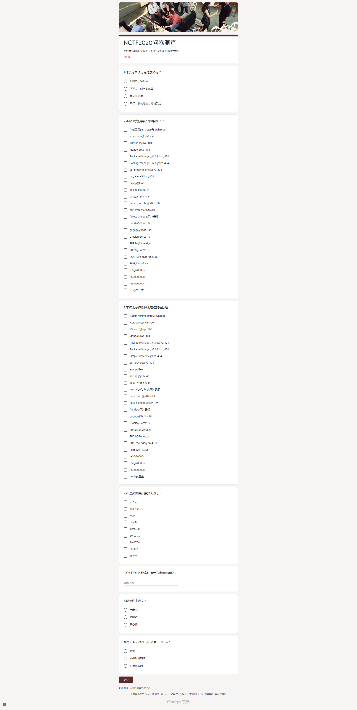

## 比赛信息

> 比赛名称：NCTF2020南京邮电大学网络攻防大赛
>
> 比赛网址：https://nctf.x1ct34m.com/
>
> 比赛时间：2020年11月21日 09:00-2020年11月22日 21:00

<br/>

### 附件链接

链接：https://pan.baidu.com/s/1hjvmeck3pIMKJb9e_E8UmQ 提取码：5555

链接：https://share.weiyun.com/lg4c6czZ 密码：555555

外链：https://t1m.lanzous.com/b0afbx61c 密码：5555

<br/>

## 题目信息

### WEB

#### JS-world(10s,526p)

> JavaScript can quickly turn our everyday job into hell, and some of them can make us laugh out loud. Have fun.
>
> hint1: script.js has sth useful.
>
> 题目地址：http://42.192.72.11:8090/

<br/>

#### Mango(3s,833p)

> Just a website with some mango pictures......
>
> hint1: mangodb or mongodb?
>
> hint2： `app.use(express.json())` is dangerous for Node.js
>
> 题目地址：http://42.192.72.11:8091/

<br/>

#### PackageManager_v1.0(5s,714p)

> Admin uses this api server to manage his package . Definitely no way to RCE.
>
> Please make sure you can exploit it locally fisrt.
>
> all packages are up to date
>
> source code: 链接：https://pan.baidu.com/s/19fm5JUvpjPEUVs528qRDSw 提取码：txai
>
> 题目地址：http://42.192.72.11:8092/

附件下载：PackageManagerv1.0.zip

<br/>

#### PackageManager_v2.0(3s,833p)

> Error fixed. Definitely no way to RCE
>
> Please make sure you can exploit it locally fisrt.
>
> all packages are up to date
>
> hint1: flag is in the `mongodb` server. You can access it using `mongodb` because of docker. Sorry for my misrepresentation.
>
> hint2: Maybe you should read the source code of `child_process` which is part of intended solution.
>
> hint3: `mongodb` url : `192.168.96.2`
>
> source code: 链接：https://pan.baidu.com/s/1DWfjNRIoy9EQAO6aF9n2Eg 提取码：xftz
>
> 题目地址：http://42.192.72.11:8093/

附件下载：PackageManagerv2.0.zip

<br/>

#### SimpleSimplePie(1s,1000p)

> 1. git clone https://github.com/simplepie/simplepie
> 2. modify index.php and rss.php
> 3. have fun XD
>
> source code: 链接：https://pan.baidu.com/s/1Ntcb0BwDyXwrq4dBFivoEQ 提取码：ijqe
>
> 题目地址：http://42.192.72.11:8094/

附件下载：SimpleSimplePie.zip

<br/>

#### bg_laravel(0s,1000p)

> bg_laravel , the best MaBaoguo site :)
>
> hint1: check out the specific laravel version.
>
> hint2: sql-injection can get you one step closer to RCE. So is ORM safe enough to prevent sql-injection?
>
> source code: 链接：https://pan.baidu.com/s/19GgVTaZOEkL-mF0_P73hqQ 提取码：p9g2
>
> 题目地址：http://42.192.72.11:8095/

附件下载：bg_laravel.zip

<br/>

#### 你就是我的master吗(50s,169p)

> 来签个到叭~
>
> 备用地址：http://42.192.72.11:10001~10007

源码下载：你就是我的master吗.zip

<br/>

#### wordpress(2s,909p)

> 认真看博客嗷！（靶机每隔40分钟左右重启一次）
>
> hint1：有没有什么信息泄露
>
> hint2：pay attention to MySQL
>
> hint3：需要提权，但是又不需要提权
>
> 题目地址：http://42.192.72.11:8000/

<br/>

#### ezphp(2s,909p)

> 10.10.*.*
>
> 附件地址：https://leonsec.lanzous.com/ictICimu79g
>
> hint: Flag in Intranet
>
> 题目地址：http://42.192.72.11:40001/

附件下载：www.tar

<br/>

### RE

#### re1(24s,303p)

> 签到1

附件下载：re1.zip

<br/>

#### re2(21s,333p)

> 签到2

附件下载：a.zip

<br/>

#### re3(5s,714p)

附件下载：re3.zip

<br/>

#### re4(2s,909p)

> 运行时关闭ida od

附件下载：qiandao.zip

<br/>

### PWN

#### master_of_libc(1s,1000p)

> 充满辩证的一生,测个libc是常见的,那么读ptmalloc源码也是应该的
>
> nc 42.192.180.50 25002

附件下载：master_of_libc.zip

<br/>

#### bruteforce(4s,769p)

> nc 42.192.180.50 25003
>
> hint1: probability is 1/16

附件下载：bruteforce.zip

<br/>

#### fake_qiandao(3s,833p)

> nc 42.192.180.50 25004
>
> hint: base64 table change and overflow

附件下载：fake_qiandao.zip

<br/>

#### frenda(0s,1000p)

> 河马老贼丧天良
>
> nc 42.192.180.50 25001
>
> hint1: house of kirin
>
> hint2: pay attention to the format string

附件下载：frenda.zip

<br/>

#### baby_vm(2s,909p)

> 签个到吧. hint:heap overflow
>
> nc 42.192.180.50 25005

附件下载：baby_vm.rar

<br/>

#### libc_rpg(0s,1000p)

> libc与人人人的奇妙冒险
>
> hint1:your weapon is bug
>
> hint2:use fastbins in libc-2.31
>
> nc 42.192.180.50 25006

附件下载：libc_rpg.rar

<br/>

#### gogogo(2s,909p)

> true_qiandao
>
> nc 42.192.180.50 25007 hint: stackoverflow

附件下载：gogogo.zip

<br/>

### CRYPTO

#### Oracle(5s,714p)

> baby oracle
>
> nc 42.192.180.50 30001
>
> 备用链接：https://soreatu-1300077947.cos.ap-nanjing.myqcloud.com/nctf2020/oracle_314ac849b899d62db6fcc3328bf6e38d.zip

附件下载：oracle_314ac849b899d62db6fcc3328bf6e38d.zip

<br/>

#### RRRSA(1s,1000p)

> a little bit harder than RRSA
>
> 42.192.180.50 30003
>
> 备用链接：https://soreatu-1300077947.cos.ap-nanjing.myqcloud.com/nctf2020/RRRSA_521c2997c738ad8522f6f9c9a8cd224e.zip

附件下载：RRRSA_521c2997c738ad8522f6f9c9a8cd224e.zip

<br/>

#### RRSA(19s,357p)

> easy RSA
>
> 42.192.180.50 30002
>
> 备用链接：https://soreatu-1300077947.cos.ap-nanjing.myqcloud.com/nctf2020/RRSA_07a1c836e966cf97acb9ad836f617fcd.zip

附件下载：RRSA_07a1c836e966cf97acb9ad836f617fcd.zip

<br/>

#### RDH(4s,769p)

> Reversible data hiding
>
> 备用链接：https://soreatu-1300077947.cos.ap-nanjing.myqcloud.com/nctf2020/RDH_ba0663386766074926b3ecc3d38e486a.zip

附件下载：RDH_ba0663386766074926b3ecc3d38e486a.zip

<br/>

#### RSA_revenge(1s,1000p)

> factorization
>
> nc 42.192.180.50 30004
>
> 备用链接：https://soreatu-1300077947.cos.ap-nanjing.myqcloud.com/nctf2020/RSA_revenge_7881a76f30afca7a4f69f4c25ee49a62.zip

附件下载：RSA_revenge_7881a76f30afca7a4f69f4c25ee49a62.zip

<br/>

### MISC

#### 彩蛋(162s,58p)

> 如果你有仔细观察过美丽的校园，如果你有来帐篷面基过帅气的肥猫嘤嘤，如果你有关注过小绿草信息安全科创实验室的公众号，那么答案一定在你心里

```
NCTF{We1c0m3_t0_NCTF2020}
```

<br/>

#### NCTF2020问卷调查(45s,185p)

> 来花个时间填写问卷叭~
>
> 记得科学上网
>
> https://forms.gle/arp4mmX3rgn81Ts37

```
NCTF{Let's_look_forward_to_X1CTF}
```

<br/>

