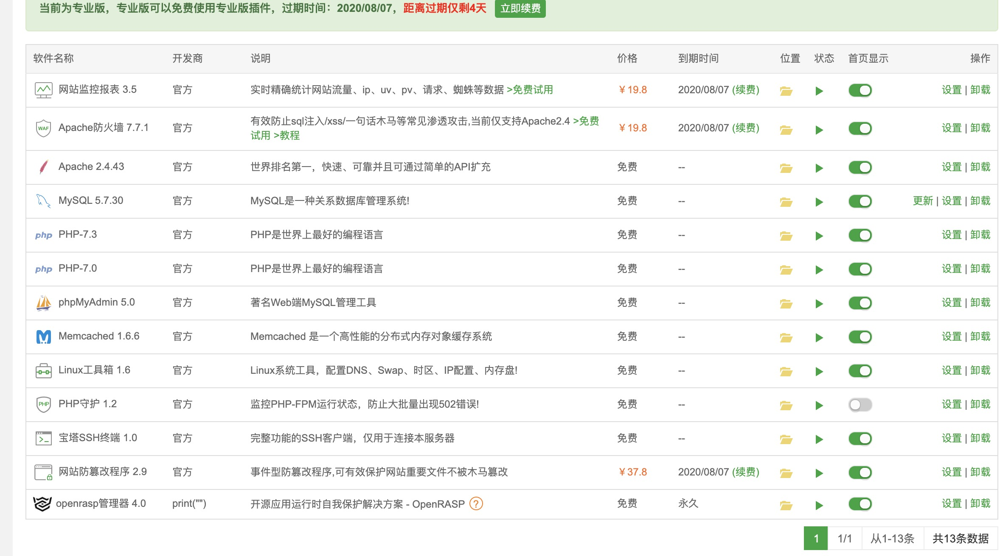

## WMCTF

### 比赛信息

> 比赛时间：2020-08-01 09:00~2020-08-03 09:00


## Writeup

[2020-WMCTF writeup By Nu1L.pdf](../writeup/2020-WMCTF writeup By Nu1L.pdf)

[2020-WMCTF_官方WriteUp.pdf](../writeup/2020-WMCTF_官方WriteUp.pdf)

[WMCTF-WriteUp-ChaMd5安全团队](https://mp.weixin.qq.com/s/SddIi7Om8BACyo_X1Skdfg)

[2020 WMCTF Web Writeup-嘶吼](https://mp.weixin.qq.com/s/tgoOINKa0Lu2i_0-Bsq18A)


## 附件链接

链接：https://pan.baidu.com/s/19rMlt_HcYy03rAOrR9Gwow 提取码：hdxw

链接：https://share.weiyun.com/Sq8mNMvu 密码：wzfh5a

外链:https://t1m.lanzous.com/b0af2nane 密码:hdxw


## CRYPTO

### piece_of_cake

> China:
> nc 81.68.174.63 8631
>
> Overseas:
> nc 170.106.35.18 8631

附件下载：372e17971a714e1ba9bb4d57f1611420.zip


### Sum

> Special case of a NP-complete problem.
>
> hint: The intended solution (keep running BKZ algorithms) requires hundreds of CPU hours, but can be speeded up by multicore computing. Good luck!

附件下载：61f9ccc9a594429594bd3f229f18ec4e.zip


### Game

> An arrogant prince is cursed to live as a terrifying beast until he finds true love.
>
> China:
> nc 81.68.174.63 16442
>
> Overseas:
> nc 170.106.35.18 16442

附件下载：e6df87ffa48f41a688ecf04b493fd7f3.zip


### idiot box

> China:
> nc 81.68.174.63 34129
>
> Overseas:
> nc 170.106.35.18 34129

附件下载：c489b7bd4415480aa8a98c12d869ea03.zip


### babySum

附件下载：ab0afb310260486c9ac5486e2238306a.zip


## MISC

### Dalabengba

> Play game and get flag！
> The flag was divided into three parts, the format is WMCTF{part1+part2=part3}.
>
> https://www.youtube.com/watch?reload=9&v=NYNLq2AIw_s
> https://music.163.com/#/song?id=521493845
>
> hint1: Try to fix the bug in the gane to start your journey？
>
> hint2: About English version：We quickly made the English version of the game, please put this data package where it should be to patch the game. http://cos.wmctf.wetolink.com/data.rar

附件下载：Dalabengba.rar（233M）、data.rar


### python_is_fun

> Is this web trick, pwn trick or misc trick?
>
> China:
> nc 81.68.174.63 46612
>
> Overseas:
> nc 170.106.35.18 46612
>
> Hint 1: It is basically some web trick but you are going to do it in bytecode 提示1:基本是web trick，但是要用bytecode写
>
> Hint2: `<built-in function __build_class__>`

```python
# Python 3.6.9 (default, Jul 17 2020, 12:50:27)
[GCC 8.4.0]
# coding:utf8
import binascii
import sys

print("# Python " + sys.version)
with open(__file__,"r") as file:
    print(file.read())
    print()

code = (lambda a:1145141919810).__code__.__class__
gift = getattr
bytecode = binascii.a2b_hex(input('Give your shellcode:').encode())

if(len(bytecode) > 114514):
    print("your shellcode bad bad! too long!")
    exit(0)

target = code(0,0,114,114,64,bytecode,(gift,),(),(),'','',114,b'')

result = eval(target,{},{})
#print(result) #not giving it to you!
print("execution of shellcode success!")
exit(0)

Give your shellcode:
```


### Performance_artist

> Performance artist released his new work: handwriting HEX characters on paper to remind people that this gorgeous flag should reside in their memory instead of a stream of 0s and 1s.
>
> hint: Dataset: numbers MNIST,letters EMNIST

附件下载：ab9afbbab77549ef94c31f515fce5d53.zip


### Music_game

> Please say “up,down,left,right” to control the tank to the base
>
> China:
> https://game1.wmctf.wetolink.com:440
> https://game1.wmctf.wetolink.com:441
> https://game1.wmctf.wetolink.com:442
> https://game1.wmctf.wetolink.com/
> https://game1.wmctf.wetolink.com:444
> https://game1.wmctf.wetolink.com:445
> https://game1.wmctf.wetolink.com:446
> https://game1.wmctf.wetolink.com:447
> https://game1.wmctf.wetolink.com:448
> https://game1.wmctf.wetolink.com:449
>
> Overseas:
> https://game1.wmctf1.wetolink.com/
> https://game1.wmctf1.wetolink.com:444
> https://game1.wmctf1.wetolink.com:445
> https://game1.wmctf1.wetolink.com:446
>
> hint: Add multiple servers


### Music_game_2

> You must’ve found that the previous challenge often recognizes incorrectly. Indeed, we can “cheat” the game by making subtle changes to the audio and let it make a wrong judgment.
>
> China:
> https://game2.wmctf.wetolink.com:4430/
> https://game2.wmctf.wetolink.com:4431/
> https://game2.wmctf.wetolink.com:4432/
> https://game2.wmctf.wetolink.com:4433/
> https://game2.wmctf.wetolink.com:4434/
> https://game2.wmctf.wetolink.com:4435/
> https://game2.wmctf.wetolink.com:4436/
> Overseas:
> https://game2.wmctf1.wetolink.com:4430/
> https://game2.wmctf1.wetolink.com:4431/
> https://game2.wmctf1.wetolink.com:4432/
> https://game2.wmctf1.wetolink.com:4433/
> https://game2.wmctf1.wetolink.com:4434/
> https://game2.wmctf1.wetolink.com:4435/

附件下载：arrachment.zip


### Ipcam

> As an ethical hacker, please do not attack the infrastructure
>
> 49.234.27.222

附件下载：9698c4c541d240dbb5c47fb9b248b3fc.zip


### XMAN_Happy_birthday!

> XMAN_Happy_birthday!

附件下载：a129d99659f34479a7d40afd4a10b5ae.zip


### sign-in

> welcome to WMCTF2020,here is your flag: https://t.me/WMCTF

```
WMCTF{W3lc0me_tO_WMCTF2020}
```


### FeedBack

> We need your FeedBack!
> https://forms.gle/SmTytGGhvYxDtuoA7

```
WMCTF{Thanks_for_your_FeedBack}
```


## WEB

### web_checkin

> China:
> http://web_checkin.wmctf.wetolink.com
>
> Overseas:
> http://web_checkin.wmctf1.wetolink.com

```php
<?php
//PHP 7.0.33 Apache/2.4.25
error_reporting(0);
$sandbox = '/var/www/html/' . md5($_SERVER['REMOTE_ADDR']);
@mkdir($sandbox);
@chdir($sandbox);
highlight_file(__FILE__);
if(isset($_GET['content'])) {
    $content = $_GET['content'];
    if(preg_match('/iconv|UCS|UTF|rot|quoted|base64/i',$content))
         die('hacker');
    if(file_exists($content))
        require_once($content);
    file_put_contents($content,'<?php exit();'.$content);
}
```


### Make PHP Great Again

> And, Yes, We will make PHP great again.
>
> http://no_body_knows_php_better_than_me.glzjin.wmctf.wetolink.com
> http://no_body_knows_php_better_than_me.glzjin.wmctf1.wetolink.com

```php
<?php
highlight_file(__FILE__);
require_once 'flag.php';
if(isset($_GET['file'])) {
  require_once $_GET['file'];
}
```


### NobodyKnowsBaoTaBetterThanMe

> Nobody Knows BaoTa Better Than Me.
>
> http://make_baota_great_again.glzjin.wmctf.wetolink.com
> http://make_baota_great_again.glzjin.wmctf1.wetolink.com
>
> hint1: I have installed the leanest premium version of Baota www.bt.cn. And installed lots of plugins in it.
>
> hint2: The challenge is inspired by real pentest

附件下载：bak.zip

插件列表：



Apache Waf -> 防篡改 -> openrasp -> php7.0

```
WMCTF{Y0u_S33_Th15_H4mbu29er_15_0Kay_or_N0t}
```

writeup: https://www.zhaoj.in/read-6660.html


### SimpleAuth

> http://simple.wmctf.wetolink.com/


### Login me again and again

> flag in /flag, the machines cannot access the internet
>
> China:
> http://login.wmctf.wetolink.com/
>
> Overseas:
> http://login.wmctf1.wetolink.com/
>
> hint1: I don't know why I add this complety useless proxy, But it is fun! 我不知道我为什么要加这个全部木大(直译:完全没有用)的代理，但是它很有趣！
>
> hint2: That badly-written proxy made us installed requests in our front server, It should be removed asap. 那个写的很差的代理使我们的front服务器需要安装requests，它应该立刻被移除。
>
> hint3: Note from operator: I installed a version of python without SSL support because it conflicts with one of our (imaginary)products, As our backend server is enforced with SSL, bitbanging mysql in python seems impossible, that's a good news. 来自运维的留言:因为和我们的一个(不存在的)项目产生冲突，我安装了一个没有SSL支持的python版本。我们的后端服务器在被攻击后，吸取了教训，采用了SSL，我认为攻击者想通过python实现mysql是不可能的，这看起来是个好消息。
>
> hint4: As the old saying says, 'All seems fine'


### gogogo

> Challenge to reset every 10min
>
> China:
> http://gogogo.wmctf.wetolink.com
>
> Overseas:
> http://gogogo.wmctf1.wetolink.com

附件下载：8372858daa2c4b5bb0584ce74b6d58df.zip


### base64

> China:
> http://base.wmctf.wetolink.com
> Overseas:
> http://base.wmctf1.wetolink.com
>
> hint: maybe you need a pwner

源码下载：b64.zip


### easycoherence

> China:
> http://easycoherenc.wmctf.wetolink.com/
> Overseas:
> http://easycoherenc.wmctf1.wetolink.com/
>
> hint: Solve the inconsistency of serialVersionUID between different coherence versions.

java留言页面


### web_checkin2

> China:
> http://web_checkin2.wmctf.wetolink.com
>
> Overseas:
> http://web_checkin2.wmctf1.wetolink.com
>
> hint: Brute force is not needed


### webweb

> China:
> http://webweb.wmctf.wetolink.com
>
> Overseas:
> http://webweb.wmctf1.wetolink.com

附件下载：42aa278af89247f2aca94857e10ad021.zip


### Make PHP Great Again 2.0

> And, Yes, We will make PHP great again and again.
>
> China:
> http://v2222.no_body_knows_php_better_than_me.glzjin.wmctf.wetolink.com/
>
> Overseas:
> http://v2222.no_body_knows_php_better_than_me.glzjin.wmctf1.wetolink.com/

```php
<?php
highlight_file(__FILE__);
require_once 'flag.php';
if(isset($_GET['file'])) {
  require_once $_GET['file'];
}
```


## REVERSE

### easy_re

> The flag is hidden in the perl code, can you find it?

附件下载：93189becd140475091c10c0ea00c59ca.zip


### Wmware

> ./bochs -q

附件下载：b11ffd502a334b2cbeed064aea5d913b.zip


### Welcome to CTF

附件下载：3b2d6fd20e0c4f0fa8ec40c018cf02d0.zip


### Meet_in_July

附件下载：fd5e0f7825134b6086efc9f1860143be.zip


### easy_apk

> hint: update attachment（更新了附件）

附件下载：435775eca6594d749e71e006ebb4de9b.zip


## PWN

### roshambo

> China:
> nc 81.68.174.63 64681
>
> Overseas:
> nc 170.106.35.18 64681

附件下载：4b4ddb8c25bb4b21a7ab420f83c6ddf2.zip


### cfgo-CheckIn

> China:
> nc 81.68.174.63 62176
> Overseas:
> nc 170.106.35.18 62176

附件下载：ff3a8775b78240a89e9845925c608467.zip


### cfgo-LuckyMaze

> China:
> nc 81.68.174.63 61552
>
> Overseas:
> nc 170.106.35.18 61552
>
> hint1: Race Condition.
>
> hint2: Some useful operations, wws、aad、etc。And u need lucky！！！

附件下载：c55577361fb146e5855e16f2a3e4586b.zip


### mengyedekending

> nc 111.73.46.229 51000

附件下载：For Attacker.zip


### baby_mac

> checkin!
> This is a baby mac pwn.
> please execute system("/readflag") to get flag.
>
> nc 43.226.148.54 20000

附件下载：c0868b606f434add934a6e0fe5bdc810.zip