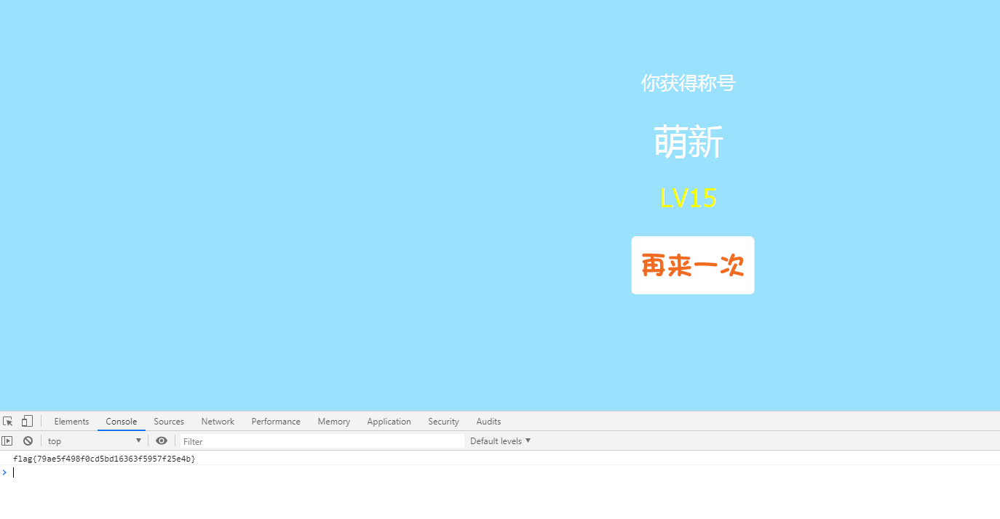
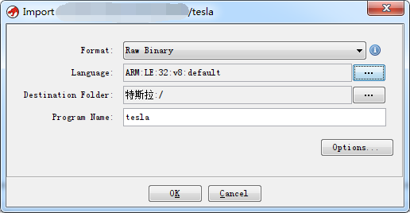
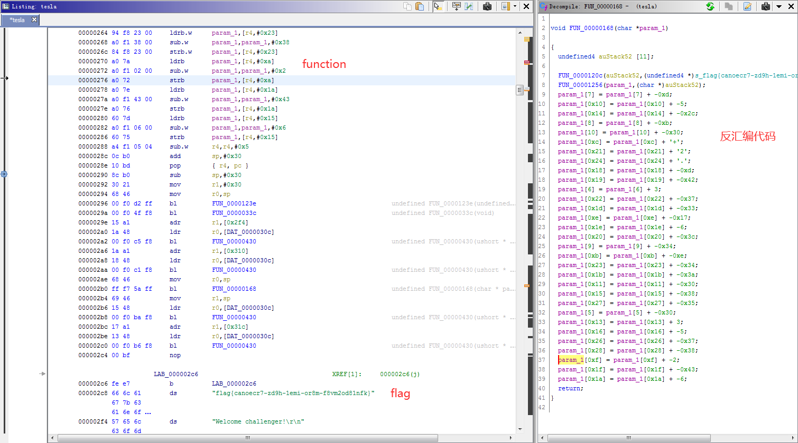

# 网鼎杯-青龙组

[网鼎拾遗-赛事举办方](https://mp.weixin.qq.com/s/FTwfhbOnJuEXHeiMxt-pLA)


## MISC

### 签到（2427队5pt）
> Weclome~!

根据战队名猜logo，有3次错误机会，最后结束时到达Lv15就会出现弹窗，输入团队token，点确定后就能在浏览器console中得到flag



### Teslaaaaa（3队455pt）

> 
>
> Now I have my own sports car, and I get an odd file in the 4S shop. Can you find out the secret in this file?
>
> [附件下载](https://pan.baidu.com/s/1R_iKyeGFjSRpgVKIS7AUzg) 提取码：(vxyq) [备用下载](https://share.weiyun.com/56wAilJ)
>
> hint: UDS诊断协议（ISO 15765-2， ISO 14229-1）

附件下载：teslaaaaa.zip

> 其他wp：https://bbs.pediy.com/thread-259472.htm
>
> 下面为@ThTsOd(1771130089)提供思路

数据全部由Tx发出，提取出所有Tx的hex数据

```python
f1 = open("ecu_can_log.asc")
f2 = open("hex.bin","w")
for line in f1.readlines():
    if "Tx" in line:
        f2.write(line[40:63]+"\n")
f2.close()
```

提取结果如下所示

```bash
02 3E 80 00 00 00 00 00 # 开头安全验证
02 3E 80 00 00 00 00 00
02 10 02 AA AA AA AA AA
02 27 05 AA AA AA AA AA
06 27 06 EE DD CC BB AA
10 0D 31 01 FF 00 44 08 # 第一列10代表连续帧首帧
21 00 00 00 00 00 20 00 # 第一列2x代表连续帧中第几帧
10 0B 34 00 44 08 00 00
21 00 00 00 20 00 AA AA
10 82 36 01 28 04 00 20 # 82 36 ??，其中??代表传输次序
21 45 01 00 08 21 03 00
22 08 23 03 00 08 27 03
23 00 08 2B 03 00 08 2F
24 03 00 08 00 00 00 00
25 00 00 00 00 00 00 00
26 00 00 00 00 00 33 03
27 00 08 35 03 00 08 00
......
2F AA AA AA AA AA AA AA # 填充字节
20 AA AA AA AA AA AA AA
21 AA AA AA AA AA AA AA
22 AA AA AA AA AA AA AA
02 37 01 AA AA AA AA AA
04 31 01 DF FF AA AA AA
04 31 01 FF 01 AA AA AA
02 11 01 AA AA AA AA AA
02 3E 80 00 00 00 00 00
02 3E 80 00 00 00 00 00
```

修改后代码为

```python
f1 = open("ecu_can_log.asc")
f2 = open("tesla","wb")
start = False
for line in f1.readlines():
    if "Tx" in line:
        if line[40:].startswith("10 82 36 01"):# 去掉开头安全验证
            start = True
        if start and (line[40] == "1" or line[40] == "2"):
            if line[40:].startswith("10 82 36"):
                line = line[52:63]# 去掉10 82 36 ??传输次序信息
            else:
                line = line[43:63]# 去掉 10 或 2x
            line = line.replace(" ","")
            while line.endswith("AA"):
                line = line[:-2]# 删除末尾的AA填充
            if line:
                f2.write(bytes.fromhex(line))# 或导出hex使用010Editor等工具保存为二进制文件
f2.close()
```

ghidra下载链接：https://pan.baidu.com/s/1RSIST4AnPBDWZXWRyjwM1g 提取码：yrnl

使用ghidra新建本地project，导入文件，选择ARMv8小端程序



双击导入后的文件，Analyze选择是，勾上所有项，找到flag，及上面的函数



导出反汇编代码，复制出flag，简单整理一下，运行得到flag

```c++
#include "pch.h"
#include <iostream>

void FUN_00000168(char *param_1)
{
	param_1[7] = param_1[7] + -0xd;
	param_1[0x10] = param_1[0x10] + -5;
	param_1[0x14] = param_1[0x14] + -0x2c;
	param_1[8] = param_1[8] + -0xb;
	param_1[10] = param_1[10] + -0x30;
	param_1[0xc] = param_1[0xc] + '+';
	param_1[0x21] = param_1[0x21] + '2';
	param_1[0x24] = param_1[0x24] + '.';
	param_1[0x18] = param_1[0x18] + -0xd;
	param_1[0x19] = param_1[0x19] + -0x42;
	param_1[6] = param_1[6] + 3;
	param_1[0x22] = param_1[0x22] + -0x37;
	param_1[0x1d] = param_1[0x1d] + -0x33;
	param_1[0xe] = param_1[0xe] + -0x17;
	param_1[0x1e] = param_1[0x1e] + -6;
	param_1[0x20] = param_1[0x20] + -0x3c;
	param_1[9] = param_1[9] + -0x34;
	param_1[0xb] = param_1[0xb] + -0xe;
	param_1[0x23] = param_1[0x23] + -0x34;
	param_1[0x1b] = param_1[0x1b] + -0x3a;
	param_1[0x11] = param_1[0x11] + -0x30;
	param_1[0x15] = param_1[0x15] + -0x38;
	param_1[0x27] = param_1[0x27] + -0x35;
	param_1[5] = param_1[5] + -0x30;
	param_1[0x13] = param_1[0x13] + 3;
	param_1[0x16] = param_1[0x16] + -5;
	param_1[0x26] = param_1[0x26] + -0x37;
	param_1[0x28] = param_1[0x28] + -0x38;
	param_1[0xf] = param_1[0xf] + -2;
	param_1[0x1f] = param_1[0x1f] + -0x43;
	param_1[0x1a] = param_1[0x1a] + -6;
	printf(param_1);
}
int main()
{
	char flag[] = "flag{canoecr7-zd9h-1emi-or8m-f8vm2od81nfk}";
	FUN_00000168(flag);
}
```

```
flag{3dad13db-cb48-495d-b023-3231d80f1713}
```

### 虚幻2（26队223pt）

> 18年虚幻被打的很惨，2年后虚幻卷土重来。
>
> [附件下载](https://pan.baidu.com/s/1S1DpB7mNmvLUQl-QxeIyHg) 提取码：(b5kt) [备用下载](https://share.weiyun.com/56uQA6g)
>
> hint: 1. 汉信码 2. 图片要转转 3. 暴力修补

附件下载：虚幻2.zip

> 以下是不愿透漏姓名的师傅们赛后在群里讨论的思路整理

```python
from PIL import Image

file = "file.png"

img = Image.open(file)
width,height = img.size

bei=15 # 结果放大倍数
imghxm = Image.new('RGB', (width*bei, height*bei*3))

for h in range(height):
    for w in range(width):
        r, g, b = img.getpixel((w, h))
        for y in range(bei):
            for x in range(bei):
                imghxm.putpixel((w*bei+x,(h*3)*bei+y), (r,r,r))
                imghxm.putpixel((w*bei+x,(h*3+1)*bei+y), (g,g,g))
                imghxm.putpixel((w*bei+x,(h*3+2)*bei+y), (b,b,b))
imghxm.save("hxm.png")
```

生成的hxm.png经过“闪转腾挪”得到下图


接下来暴力修补（右边空白处随便画点什么，看运气），解码后得到flag


```
flag{eed70c7d-e530-49ba-ad45-80fdb7872e0a}
```

也有通过爬解码网站：http://www.efittech.com/hxdec.html 历史解码记录成功上车的，例如：http://www.efittech.com/upload/pics/pic_20200514222602.png

### 未完成的书（0队500pt）
> 有數二零二零。名之曰「嗷」。吾有一言。曰「嗷」。書之。
>
> [附件下载](https://pan.baidu.com/s/19DNXzlUSGLQXbViD5QUoeQ) 提取码：(sghn) [备用下载](https://share.weiyun.com/5LcDULm)
>
> hint: 1. wenyan-lang 2. js 混淆，在线IDE 3. baseRSA

附件下载：未完成的书.zip


## WEB

### AreUSerialz（713队14pt）
> find the flag

源码下载：AreUSerialz.zip


### trace（37队179pt）
> find the flag


### notes（82队100pt）
> 小明学习js觉得真好玩，于是自⼰搞了一个记录笔记的网站。
>
> 附件：https://pan.baidu.com/s/1h33louR2WSSTKntBF6klEA 提取码：(v9xe)备用：https://share.weiyun.com/5GhUabm

附件下载：notes.zip


### filejava（199队46pt）
> 小明同学把最近开发的一个简易文件上传系统挂到了服务器上，但过了段时间收到了漏洞报警，你能帮他找到是哪里出了问题吗？

源码下载：filejava.zip


## Reverse

### bang（450队22pt）
> 简单加壳。
>
> [附件下载](https://pan.baidu.com/s/1079f9PapvZyn2qMmHvHBug) 提取码：(9fs3) [备用下载](https://share.weiyun.com/5N7KJsg)

附件下载：bang.zip


### rev01（0队500pt）
> apk逆向。
>
> [附件下载](https://pan.baidu.com/s/1Ozux3g3JceBMWvZDYTfhoA) 提取码：(mfmh) [备用下载](https://share.weiyun.com/5tOJDfd)

附件下载：rev01.zip


### jocker（214队43pt）
> 马戏团的小丑想和大家一起玩个游戏。
>
> [附件下载](https://pan.baidu.com/s/1dDhlUw0HE2cBAcpY_QLsVw) 提取码：(n3qe) [备用下载](https://share.weiyun.com/57tAwwy)

附件下载：jocker.zip


### signal（464队21pt）
> 跟着信号一起走。
>
> [附件下载](https://pan.baidu.com/s/1lOwU8lEt4b88H4JDMEfitw) 提取码：(7afs) [备用下载](https://share.weiyun.com/5IEwmvl)

附件下载：signal.zip


## crypto

### boom（1418队7pt）
> Boom there have a game.
>
> [附件下载](https://pan.baidu.com/s/1cbXhylOY3scsFwJwGoBpfw) 提取码：(5w89) [备用下载](https://share.weiyun.com/5FBXctl)

附件下载：boom.zip


### you raise me up（547队18pt）
> you raise me up.
>
> [附件下载](https://pan.baidu.com/s/127CeUOsrZIrEExcmrL2tBQ) 提取码：(c6eh) [备用下载](https://share.weiyun.com/5aL4Cmj)

附件下载：you_raise_me_up.zip


### easy_ya（56队134pt）
> nc 39.96.90.217 17497
>
> [附件下载](https://pan.baidu.com/s/1Fh5EJJ-vQK6uTjFr2cuHHQ) 提取码：(daeb) [备用下载](https://share.weiyun.com/5KEZnW5)

附件下载：easy_ya.zip


## PWN

### boom1（237队40pt）
> nc 182.92.73.10 24573
>
> [附件下载](https://pan.baidu.com/s/1TOprpjG8vypyyVFuE5j67w) 提取码：(m03n) [备用下载](https://share.weiyun.com/5ZJxYhU)

附件下载：boom1.zip


### boom2（82队100pt）
> nc 182.92.73.10 36642
>
> [附件下载](https://pan.baidu.com/s/17UUmwn5IUGyhxMsfNUTXUg) 提取码：(byfy) [备用下载](https://share.weiyun.com/5WRuCTk)

附件下载：boom2.zip


### faster0（21队250pt）
> nc 39.96.72.181 42732
> 本题没有附件。


